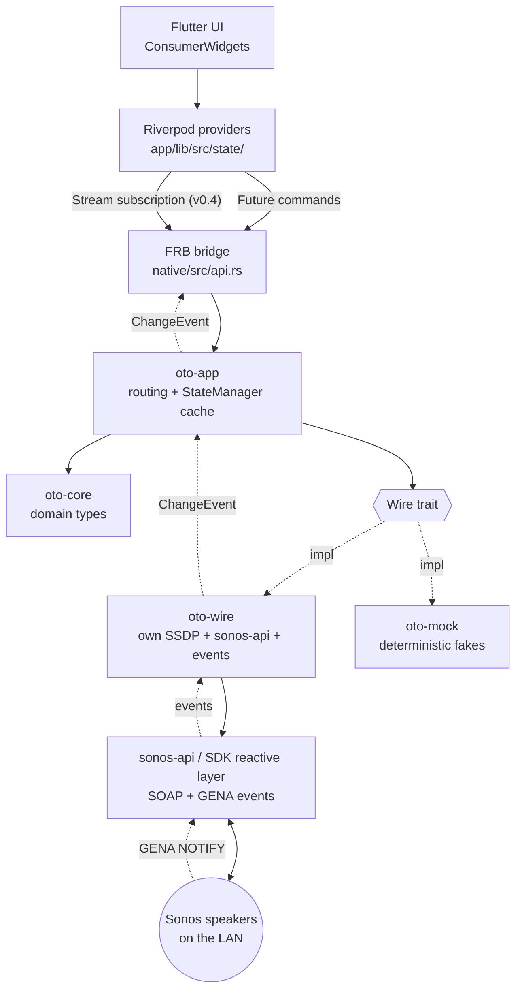
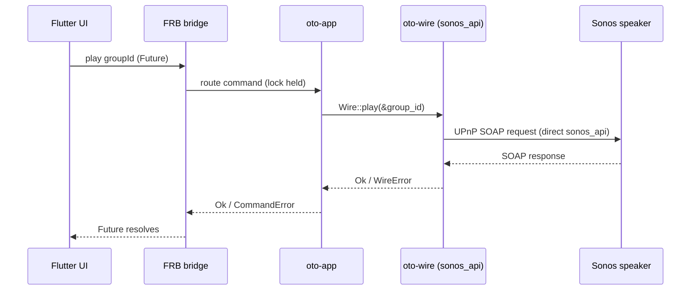
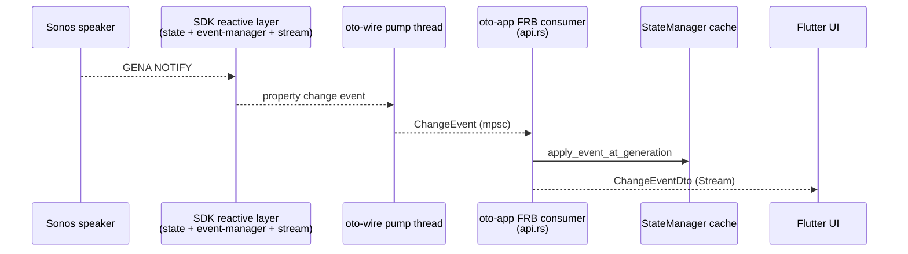

# Architecture

How oto is structured: a Flutter UI over a Rust core, with Sonos networking handled in Rust - SSDP and SOAP via `sonos-api`, live events via the same SDK family's reactive layer, and discovery via oto's own multi-NIC SSDP.

Sibling docs: [ROADMAP.md](ROADMAP.md) for milestone status and forward plan; [sonos-notes.md](sonos-notes.md) for Sonos protocol / SDK reference.

## Layers



Solid arrows are command-direction (UI → FRB → … → speakers); dashed arrows are event-direction (speakers → … → UI). v0.4 added the event path: GENA NOTIFY → SDK reactive layer → `oto-wire` pump thread → `oto-app` StateManager cache + FRB stream → Dart `ChangeEventDto` stream.

## Crates

| Crate | Path | Responsibility |
|---|---|---|
| `oto_native` | `native/` | FRB cdylib. Thin shim - `discover()` / `refresh_topology()` + non-sync commands (playback, group volume/mute, form/break, `track_position`) + identity/playback/event DTOs + `CommandError`; delegates to `oto-app`. Also exposes a `dev_*` mock-injection seam (`dev_discover_mock`, `dev_push_subscription_error_on_mock`, `dev_push_topology_change_on_mock`, a `MockWireArc` adapter) so `app/integration_test/` can drive the v0.4 event surface without a LAN. The `pub fn` symbols are unconditional (FRB's generated glue references every one, so `cfg`-gating them would break the release cdylib's link), but each body is internally `cfg(debug_assertions)`-gated - inert (returns an error) in release builds, never touching the production wire. |
| `oto-app` | `native/crates/app` | Owns runtime state (the active `Wire` in a process-global, lock held across SOAP); routes `discover()` / `refresh_topology()`, the playback + group commands, and `track_position` reads. |
| `oto-core` | `native/crates/core` | Pure domain types (`Speaker`, `Group`, `TransportState`, `Track`, `Volume`, identifiers, `SpeakerState`, `SpeakerIdentity`, `GroupIdentity`, `DiscoverySnapshot`) + the `Wire` trait + `WireError`. No networking, no async, no third-party deps. |
| `oto-wire` | `native/crates/wire` | Production `Wire`: own multi-NIC SSDP + direct `sonos_api` (=0.5.2) SOAP for discovery, playback control, group operations (v0.5.1: form/break + group volume/mute), and one-shot state reads; v0.4 live property events (+ v0.5.1 group volume/mute) use the upstream reactive state/event layer from the same SDK family. No `SonosSystem`. Interior-mutable id→addr / group→coordinator / speaker→coordinator cache populated by `discover()`. A no-SSDP seeded constructor (`new_seeded`) backs the v0.5.1 fast re-discover. |
| `oto-mock` | `native/crates/mock` | Stateful `Wire` implementation (`MockWire`) - in-memory per-speaker model (commands mutate it, `speaker_state` reflects it); integration tests run without a LAN. |

The Dart side is Flutter + Riverpod 3 (codegen). Providers live in `app/lib/src/state/`; FRB-generated bindings in `app/lib/src/rust/`.

## State ownership

State lives in Rust, not Dart. v0.4 swapped `speaker_state` from a per-call SOAP read to a read against the `StateManager` cache in `oto-app`. The cache is event-fed: `oto-wire`'s pump thread converts GENA NOTIFYs (and SDK-internal polling for the few properties Sonos doesn't NOTIFY) into `ChangeEvent`s, the FRB consumer loop applies each to the cache, and `speaker_state` reads from there. The `Wire::speaker_state` trait method is preserved for hardware-baseline tests and `MockWire`'s own unit tests but is no longer dispatched in production.

Consequences:

- State survives Flutter hot reload / UI restart.
- A non-Flutter client (e.g. a CLI) could reuse the same core unchanged.
- State mutations happen where network events are handled (Rust), avoiding cross-FFI consistency bugs.
- **`speaker_state` is honest-partial during cold-start.** Fields for which no event has arrived yet are `None`; the SDK's initial SUBSCRIBE NOTIFY seeds the common case within ~1 s. An unknown speaker id still returns `WireError::NotFound` (topology is the source of truth for "is this id real?").
- **The cache is per-process and ephemeral** - cleared on every `discover_with` via a generation token, so a wire replacement can't leave stale state visible to the new wire's seeds.

## Command flow

**Commands are non-sync.** Every FRB *command* - `discover()` and all playback commands - is a default (non-sync) FRB fn returning a Dart `Future`, run off the UI isolate by FRB's worker executor. Each is a blocking SOAP round-trip (~tens–hundreds of ms), **except `speaker_state`, which is a fast in-memory read of the event-fed `StateManager` cache** (still surfaced as a `Future`; see [State ownership](#state-ownership)). The lone synchronous FRB fn is `current_wire_generation()` (`#[frb(sync)]`) - a cheap atomic read the Dart event-stream provider keys its re-subscription on; it is a getter, not a command.

**Discovery** blocks ~3–5 s (own multi-NIC SSDP + `GetZoneGroupState` SOAP to first responder), returns an identity snapshot with real group topology, and is idempotent (`oto-app` replaces the held `Wire` on success). It is **never on the `#[frb(init)]` path**.

**Playback commands** (`play/pause/next/previous` addressed by `GroupId`; `set_volume`/`set_mute` addressed by `SpeakerId`) are each a blocking SOAP round-trip via `sonos_api` directly - no `SonosSystem`. `oto-wire` resolves a `GroupId` → coordinator → `SocketAddr` from its interior-mutable cache (populated by `discover()`); a command before discovery, or for an unknown ID, returns `WireError::NotFound`. `speaker_state` (also `SpeakerId`-addressed) is **not** a SOAP call - it reads the `StateManager` cache (see [State ownership](#state-ownership)).

**Group addressing.** `discover()` reads `GetZoneGroupState` from any responding speaker and builds the group→coordinator / speaker→coordinator caches; `GroupId` resolution uses those caches. `Wire` signatures are stable across the v0.2 group-of-one → v0.3 real-topology change (the seam was designed for this).

**`speaker_state` addressing (D2).** Volume/mute are per-speaker (cached from `Volume` / `Mute` events); transport is per-group (cached from `Playback` / `Track` events at the group coordinator). The cache stores transport per `GroupId`; the read resolves speaker → group via the `StateManager`'s topology map (installed on every `discover_with`) → group transport cache. A solo speaker is its own coordinator, so the resolution degrades cleanly.

**Topology refresh (v0.5 / v0.5.1).** Caches are populated by `discover()` and re-populated by `refresh_topology()` (`GetZoneGroupState` SOAP, no SSDP). App-side regrouping changes a group's opaque `N` suffix in `GroupId = RINCON_<coord>:N`. A live `TopologyChanged` event drives a refresh so the view follows a regroup: the Dart `TopologyController` debounces, then calls `refresh_topology()` - **v0.5.1** a no-SSDP fast re-discover (oto-app seeds a fresh wire from cached IPs through `discover_with`, reusing the proven wire-replacement lifecycle), with a full SSDP re-discover as the error fallback. **That controller is implemented and unit-tested**; the v0.6 home shell now watches it (`app/lib/src/ui/shell/home_page.dart`), so a regroup drives a live refresh. Note the fallback's timing: until a re-discover actually runs, a regrouped group's old `GroupId` stays in the cache and still routes to the *former* coordinator; the stale-`GroupId` → `WireError::NotFound` fallback only kicks in once a re-discover has changed the `N` suffix while a caller still holds the old id. (v0.4 covered property events only - volume / mute / transport / track.)

**State-read shape (`speaker_state`).** `SpeakerState { volume: Option<Volume>, muted: Option<bool>, transport: Option<TransportState> }`. The signature is identical to v0.2/v0.3, but v0.4 swapped the backing source from SOAP-per-call to the `StateManager` event cache. `Option<T>` fields are now honest partial *cold-start*: a property is `None` until its first event lands in the cache (in practice, within the SUBSCRIBE NOTIFY seed phase ~1 s after `discover()`).



## Concurrency model

`sonos-api` command calls are sync-first at oto's boundary; event subscriptions add an upstream-managed runtime internally, but no async runtime is exposed at the FRB or `Wire` command surface.

Commands are non-sync FRB fns (Dart `Future`) into blocking `sonos_api` SOAP calls. `oto-app` holds its `Mutex<Option<…>>` **locked across the SOAP call** - deliberate: commands are user-initiated and low-frequency; serializing all commands is the LAN-politeness story (no command storms against the user's speakers). Revisit only if v0.4 event threads and commands contend on the lock.

No async/await in oto's own surface code. `sonos-api` uses async internally, and v0.4's reactive event stack pulls a tokio runtime transitively via the upstream event manager. The architectural rule is that commands stay sync/blocking at the `Wire` boundary and event delivery is pumped by dedicated threads; tokio in the lockfile is not itself a violation.

## The `Wire` seam

`oto-app` depends on a `Wire` trait rather than on `sonos-api` or the SDK reactive layer directly. Production uses `oto-wire` (own SSDP + direct `sonos_api` SOAP + event subscriptions); tests use `oto-mock` (stateful in-memory fixtures). This keeps integration tests runnable without a Sonos device and isolates any future library swap to a single crate.

```rust
pub trait Wire {
    fn discover(&self) -> Result<DiscoverySnapshot, WireError>;

    // Playback - addressed by GroupId (Sonos plays per-coordinator).
    fn play(&self, group: &GroupId) -> Result<(), WireError>;
    fn pause(&self, group: &GroupId) -> Result<(), WireError>;
    fn next(&self, group: &GroupId) -> Result<(), WireError>;
    fn previous(&self, group: &GroupId) -> Result<(), WireError>;

    // Per-speaker controls.
    fn set_volume(&self, speaker: &SpeakerId, volume: Volume) -> Result<(), WireError>;
    fn set_mute(&self, speaker: &SpeakerId, muted: bool) -> Result<(), WireError>;

    // One-shot snapshot read. Kept for the v0.3 contract + MockWire
    // unit tests + hardware-baseline reads in live_events tests.
    // Production paths route through the StateManager cache instead
    // (oto-app::speaker_state), so this method is not dispatched at
    // runtime in release builds.
    fn speaker_state(&self, speaker: &SpeakerId) -> Result<SpeakerState, WireError>;

    // v0.6.1 - live SOAP read of a group's current track position and
    // duration (for the Now Playing progress bar). Unlike `speaker_state`,
    // this is a real SOAP round-trip (`GetPositionInfo`) - position and
    // duration are NOT evented (neither GENA nor the v0.4 cache carry
    // them), so there is no cache to read. Routed through the slot like
    // `play` (lock held across the SOAP call). Unknown group -> NotFound.
    fn track_position(&self, group: &GroupId) -> Result<TrackPosition, WireError>;

    // v0.4 - register the property-event pump for the speakers in
    // the latest snapshot. One-shot per wire; events flow into the
    // receiver returned by `take_event_stream`.
    fn subscribe_speakers(&self) -> Result<(), WireError>;
    fn take_event_stream(&self) -> Option<std::sync::mpsc::Receiver<ChangeEvent>>;

    // v0.5 - topology events. `subscribe_topology` registers the
    // per-speaker ZoneGroupTopology (`GroupMembership`) watch; it MUST be
    // called BEFORE `subscribe_speakers` (the watch is registered at pump
    // spawn), which `discover_with` enforces. A regroup surfaces as a
    // payload-less `ChangeEvent::TopologyChanged`. `refresh_topology`
    // re-pulls authoritative topology via `GetZoneGroupState` SOAP (no
    // SSDP); v0.5.1 puts it on the production hot path - a regroup
    // fast-refreshes via a no-SSDP re-discover (oto-app seeds a fresh
    // wire from cached IPs through `discover_with`).
    fn subscribe_topology(&self) -> Result<(), WireError>;
    fn refresh_topology(&self) -> Result<DiscoverySnapshot, WireError>;

    // v0.5.1 - group operations. Form/break addressed per-speaker (Sonos
    // primitives: `x-rincon:` SetAVTransportURI / BecomeCoordinatorOf-
    // StandaloneGroup); group volume/mute addressed by GroupId (coordinator-
    // routed, like playback). A mutation fires topology/group events that the
    // existing stream surfaces; form/break does not self-trigger a refresh.
    fn join_group(&self, speaker: &SpeakerId, coordinator: &SpeakerId) -> Result<(), WireError>;
    fn leave_group(&self, speaker: &SpeakerId) -> Result<(), WireError>;
    fn set_group_volume(&self, group: &GroupId, volume: Volume) -> Result<(), WireError>;
    fn set_group_mute(&self, group: &GroupId, muted: bool) -> Result<(), WireError>;
}
```

`DiscoverySnapshot` is built from lean identity types (`SpeakerIdentity` / `GroupIdentity`).

**Discovery.** `oto-wire` runs its own multi-interface SSDP to collect responder IPs, then issues a direct `sonos_api` `GetZoneGroupState` SOAP call to any responding speaker to retrieve the full household topology. The snapshot is built from ZoneGroupTopology members; `<Satellite Invisible="1">` children are folded into their primary speaker and never surfaced as standalone players (the v0.1 bonded-as-standalone bug is fixed by construction); `<VanishedDevices>` are ignored. The direct discovery/control path uses `sonos-api =0.5.2` (+ `quick-xml =0.31.0` for DIDL-Lite); v0.4 events add the upstream reactive state/event crates. Protocol detail: [sonos-notes.md § SSDP discovery](sonos-notes.md#ssdp-discovery), [§ Topology](sonos-notes.md#topology--getzonegroupstate-soap).

**Playback control.** `oto-wire` holds an interior-mutable id→addr / group→coordinator / speaker→coordinator cache (populated by `discover()`). Commands issue direct `sonos_api::SonosClient::execute_enhanced(ip, op)` SOAP calls. `quick-xml` is used for DIDL-Lite track-metadata parsing.

**Live events (v0.4).** `oto-wire` runs a dedicated pump thread per active wire (`crates/wire/src/events.rs`). The pump wraps the upstream SDK's `StateManager` + `SonosEventManager` + `EventBroker` stack (`sonos-sdk-state` / `sonos-sdk-event-manager` / `sonos-sdk-stream` / `sonos-sdk-callback-server`, all pinned `=0.5.2`), registers a per-property `watch_property_with_subscription` for every known speaker, and converts each upstream property change into an `oto_core::ChangeEvent` that it sends down an unbounded `std::sync::mpsc` channel. The pump thread terminates cleanly when the wire is dropped via an `Arc<AtomicBool>` stop flag (the SDK's `StateManager::Clone` fans out independent senders, so dropping a clone does not close the channel - the stop flag is load-bearing).



The Dart `changeEventsProvider` (a Riverpod `StreamProvider`) re-subscribes when a NEW wire is installed - keyed on the **wire generation** (`current_wire_generation()`, bumped by `discover_with` on success only), not raw discovery state. A *failed* re-discover keeps the old wire (whose event receiver is one-shot and can't be retaken), so gating on the generation avoids tearing the live stream down onto a dead receiver. The same `StateManager` generation makes stale-OLD-wire cache applies after a mid-stream `discover_with` no-op against the freshly-cleared cache.

**Live events (v0.5 / v0.5.1).** Additions on the same single FRB stream:

- **Topology events.** The pump also registers a per-speaker `GroupMembership` watch (ZoneGroupTopology is a *service*, not a watchable property - the change surfaces via the speaker-scoped `GroupMembership` property; see [sonos-notes § Topology change events](sonos-notes.md#topology-change-events--how-regrouping-surfaces-p0c-finding-v05)). A regroup → payload-less `ChangeEvent::TopologyChanged`; the Dart `TopologyController` (implemented + unit-tested; the v0.6 home shell now watches it) debounces 250 ms then refreshes - **v0.5.1** via a no-SSDP fast `refresh_topology()` re-discover (a full ~3-5 s SSDP re-discover in v0.5), with a full re-discover as the error fallback. Two pump-side guards make this safe: (1) the **first** `GroupMembership` per speaker, when it arrives inside a short post-spawn *seed window*, is the subscribe *seed* and is suppressed - otherwise seed → re-discover → new pump → new seed would loop forever; a first event arriving *after* the window is treated as a real regroup (its seed was dropped or delayed), so a missed seed can't permanently swallow a later regroup; (2) once a real regroup is seen the pump marks its (now-stale, frozen-at-spawn) coordinator→group routing **dirty** and drops group-addressed `Playback`/`Track`/`GroupVolume`/`GroupMute` until the pump is rebuilt by re-discover. **Resolved in v0.5.1:** `refresh_topology` is a full wire replacement (a fresh seeded wire via `discover_with`), so the new pump starts with clean routing + a clean `TopologyFilter` - no in-place mutation of the frozen maps. The Dart re-subscribe is forced via a `wireGenerationProvider` invalidation even when the new topology is value-equal to the old (FRB `Topology` has value equality, which would otherwise suppress the provider transition).
- **Group volume/mute events (v0.5.1).** The pump also watches `GroupVolume` / `GroupMute` (GroupRenderingControl, `Scope::Group`, coordinator-routed like AVTransport) and emits `ChangeEvent::{GroupVolume, GroupMute}`. These are read from the SDK's group-property store via `get_group_property(GroupId)` - NOT the per-speaker `get_property`, which reads `speaker_props` and would silently drop every group event (see [sonos-notes § Group operations](sonos-notes.md#group-operations-v051-spike--hardware-confirmed-2026-06-04)).
- **Subscription health.** `SubscriptionError` / `SubscriptionRecovered` are emitted reactively from command dispatch (`oto-app` tracks per-speaker `Healthy ↔ Errored`) onto a *separate* app-event `mpsc` bus that the FRB consumer drains alongside the wire channel. App events are stamped with the wire generation; the consumer drops stale-stamped events so a lingering old-wire health event can't surface on the new stream.

## Frontend shell (responsive, v0.6.3)

The Flutter shell is responsive over the same providers (no backend change). Layout keys off three width tiers from one helper - `LayoutTier` in `app/lib/src/state/breakpoints.dart`, read from `MediaQuery` so `OtoScaffold` and the leaf widgets share a single source of truth: compact (`<840`), tablet (`840-1200`), desktop (`>=1200`).

- **`OtoScaffold`** carries optional `detail` + `rail` slots. Compact renders the phone body unchanged; wide renders the room grid beside a persistent Now Playing pane; desktop adds a leading nav rail (a three-pane layout).
- **Selection.** `selectedSourceProvider` (the explicit pick) + `resolvedSourceProvider` (default = first active source, self-healing when a regroup drops the chosen id) drive the pane. On wide, tapping a room/group selects it in place; on phone the existing route pushes are kept. A single tier-aware `nav.dart` helper makes that choice per width.
- **`*Body` / `*Screen` split.** Detail screens split into a chrome-free `*Body` (embeddable in the pane or a dialog) and a thin `*Screen` route wrapper for phone. On wide, Now Playing renders in the pane, Settings and the group editor open as dialogs, and Room detail is folded away - a wide room tap selects its group into the pane, so the room screen is unreachable there.
- **Window bounds.** On desktop the window's size/position persists across launches via `window_manager` (best-effort, desktop-guarded; a no-op on Android).

## Scope

- **Targets:** Android (API 35+, 64-bit) and Windows. Other platforms compile but are untested.
- **Local-first:** LAN-only. No cloud, no account, no Sonos HTTP API.
- **No persistence of device/LAN state** - no speaker, topology, or live state is written to disk; all of it is in-process and rebuilt by discovery. The one on-disk exception is **local UI preferences** (theme mode, accent, home layout) persisted via `shared_preferences` (v0.6.0); nothing about the user's Sonos system is stored.

## Known constraints

- **Watch-after-fetch event suppression (resolved in v0.4).** Upstream change-detection suppresses the initial `.watch()` notification if a prior `.fetch()` already cached the same value. v0.4 sidesteps this by using `.watch()` itself as the reachability/seed probe - the initial SUBSCRIBE NOTIFY populates the cache and any code path that wants a current value reads from `StateManager` (which the pump thread fills). The fetch-then-subscribe pattern is now an anti-pattern in `oto-wire`; the production wire only calls `watch_property_with_subscription`. Detail: [sonos-notes.md § Event model](sonos-notes.md#event-model-v04-load-bearing).
- **`manager.initialize(topology)` is non-optional** for AVTransport routing. Without it, `add_devices` + `register_watches` succeed without error but per-group Playback/Track NOTIFYs route to the wrong worker and silently disappear. `oto-wire`'s pump always calls `initialize(topology)` between `add_devices` and `register_watches`. The SDK's `StateManager::Clone` fans out independent `mpsc::Sender`s - dropping a clone does not close the channel; the pump's `Drop` uses an `Arc<AtomicBool>` stop flag + `recv_timeout` polling so it can shut down without depending on sender-close semantics.
- **Android `MulticastLock` (resolved in v0.5).** SSDP multicast on the Android *release* build needs a held `WifiManager.MulticastLock` (perms are declared in the manifest); debug builds happen to work because the developer build flow keeps the radio active. A Kotlin `MulticastLockHandler` (over the `me.oszkar.oto/multicast_lock` MethodChannel) is now held around `discover()`'s SSDP window, acquired/released on the Dart side in `discoveryProvider` - best-effort (a lock failure doesn't abort discovery). v0.4 GENA events are **unicast TCP** and work without the lock; it is the SSDP in `discover()` (and any re-discover) that needs it.
- **SSDP responses are trusted (accepted risk, v0.5).** Discovery accepts any datagram carrying a `LOCATION` header - it does not validate the status line / `ST`, match the LOCATION host to the responder's source IP, or cap the candidate count. A hostile device on the user's LAN could therefore redirect discovery's follow-up `GetZoneGroupState` SOAP to an arbitrary host (port 1400 only). LAN-local and low-impact: a non-Sonos host fails to parse and is skipped, and `discover()` stops at the first responder that returns a parseable topology. Hardening (200 + `ST` + sender-IP match + candidate cap) is tracked for v0.7 (the hardening + polish bucket) - see the SSDP-hardening `TODO` in `native/crates/wire/src/ssdp.rs`.
