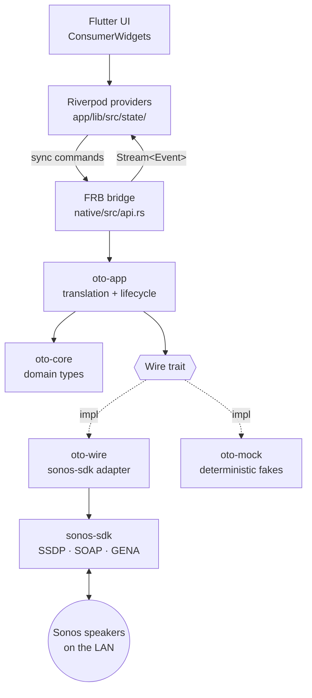
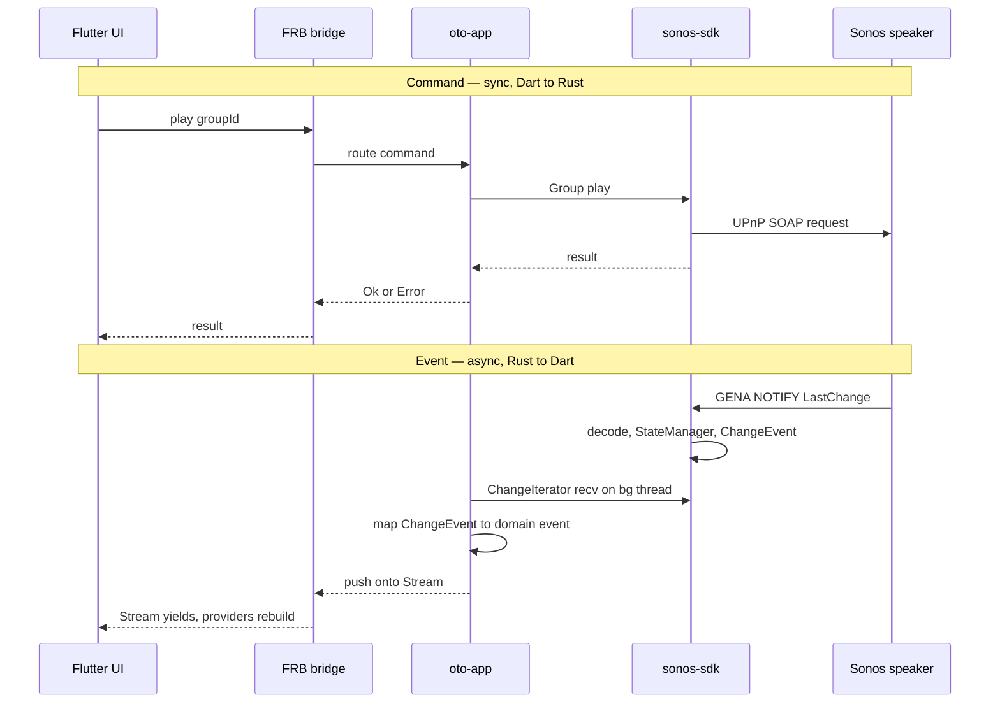

# Architecture

How oto is structured: a Flutter UI over a Rust core, with all Sonos
networking delegated to [`tatimblin/sonos-sdk`][sdk].

## Layers

## Crates

| Crate | Path | Responsibility |
|---|---|---|
| `oto_native` | `native/` | FRB cdylib. Thin shim — exposes commands and event streams to Dart, delegates everything else. |
| `oto-app` | (not yet created) | Owns the `SonosSystem` instance and the background threads that pump events. Translates `sonos_sdk` types ↔ `oto_core` types. Routes commands. |
| `oto-core` | `native/crates/core` | Pure domain types (`Speaker`, `Group`, `TransportState`, `Track`, `Volume`, identifiers). No networking, no async, no third-party deps. |
| `oto-wire` | `native/crates/wire` | Production `Wire` implementation backed by `sonos-sdk`. Currently a skeleton (pins the dependency; adapter lands later). |
| `oto-mock` | `native/crates/mock` | `Wire` implementation with deterministic in-memory fixtures, for tests without a LAN. |

The Dart side is Flutter + Riverpod 3 (codegen). Providers live in
`app/lib/src/state/`; FRB-generated bindings in `app/lib/src/rust/`.

## State ownership

State lives in Rust, not Dart. `sonos-sdk`'s `StateManager` caches
per-speaker and per-group properties and emits `ChangeEvent`s on change.
`oto-app` holds the `SonosSystem`; Dart Riverpod providers subscribe to
event streams and hold projections for rendering, not source data.

Consequences:

- State survives Flutter hot reload / UI restart.
- A non-Flutter client (e.g. a CLI) could reuse the same core unchanged.
- State mutations happen where network events are handled (Rust), avoiding
  cross-FFI consistency bugs.

## Command and event flow

Commands are synchronous Dart → Rust calls returning `Result`. Events are
an asynchronous Rust → Dart stream. The two are independent: a command's
success/failure is separate from the state change it eventually causes.

## Concurrency model

`sonos-sdk` is sync-first; no async runtime is required at the bridge.

- Commands: synchronous FRB calls into synchronous `sonos-sdk` methods.
- Events: `sonos-sdk`'s `ChangeIterator::recv()` blocks. Each event stream
  exposed to Dart is pumped by a dedicated OS thread that reads the
  iterator and pushes onto an FRB `Stream`.

No `tokio` in oto's own code. (`sonos-sdk` uses async internally; that is
encapsulated and does not surface at the `Wire` boundary.)

## The `Wire` seam

`oto-app` depends on a `Wire` trait, not on `sonos-sdk` directly.
Production uses `oto-wire` (a thin shim over `sonos-sdk`); tests use
`oto-mock` (deterministic fixtures). This keeps integration tests runnable
without a Sonos device on the network and isolates any future library swap
to a single crate.

## Scope

- **Targets:** Android (API 35+, 64-bit) and Windows. Other platforms
  compile but are untested.
- **Local-first:** LAN-only. No cloud, no account, no Sonos HTTP API.
- **No persistence** beyond what `sonos-sdk` caches in memory. No on-disk
  state or config yet.

## Open questions

To validate when the wire layer is fleshed out (the `oto-wire` adapter and
the discovery/event steps):

1. **ZoneGroupTopology coverage.** Grouping/topology event handling is the
   historical weak spot in Sonos libraries. Confirm `sonos-sdk` decodes
   topology changes (group form/break, coordinator change) reliably. If
   not, this is the first candidate for an upstream contribution.
2. **Discovery blocking on startup.** `SonosSystem::new()` performs
   discovery. If it blocks for a timeout, it must not run inside FRB's
   `init_app` (which would freeze UI startup). Likely mitigation: construct
   `SonosSystem` from a "warm up" command issued after the UI mounts.
3. **Thread count.** One OS thread per exposed event stream (blocking
   `ChangeIterator`). Cheap, but confirm the stream granularity so the
   thread count stays bounded (e.g. one multiplexed event stream rather
   than one per speaker).

## Related docs

- `docs/plans/2026-05-15-oto-core-domain-types-design.md` — rationale for
  the `oto-core` type shapes (newtypes, transport-on-`Group`, etc.).

[sdk]: https://github.com/tatimblin/sonos-sdk
