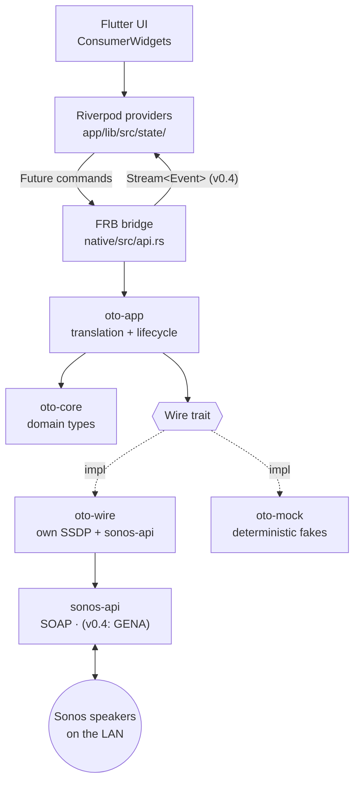
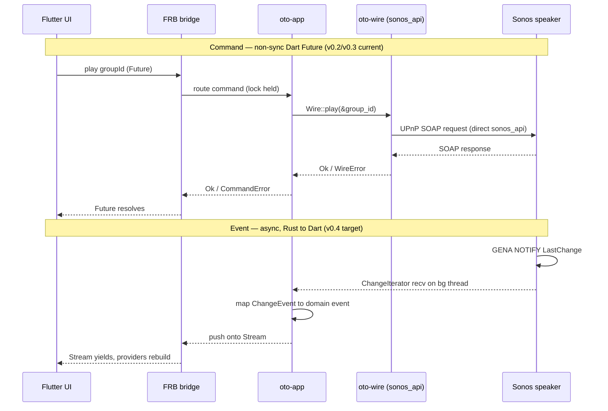

# Architecture

How oto is structured: a Flutter UI over a Rust core, with all Sonos
networking (SSDP, SOAP, GENA) handled in Rust via `sonos-api` and own
multi-NIC SSDP (see [`tatimblin/sonos-sdk`][sdk] for the upstream family).

> **Status.** v0.2 (Foundation + LAN **discovery** + **playback control**
> + one-shot **state read**) is **implemented** and hardware-verified.
> v0.3 (**real ZoneGroupTopology grouping**) is **implemented** and
> verified LAN-free (stateful mock + e2e); the ZoneGroupTopology read
> path was hardware-proven by the v0.3 spike, and full real-hardware
> grouping acceptance (the directive-7 multi-room check) is **pending**
> (plan Task 8, user-run).
> `oto-core` domain types, the `Wire` trait (discovery + 7 playback
> methods), `oto-wire` (own multi-NIC SSDP + direct `sonos_api` SOAP
> control/read/topology), `oto-mock` (stateful), `oto-app` (holds the
> `Wire`, routes all commands), and the FRB surface (non-sync `discover` +
> 7 non-sync playback commands + DTOs + `CommandError`) all exist.
> v0.3 delivers real ZoneGroupTopology via direct `sonos_api`
> `GetZoneGroupState` SOAP (Open Q1 resolved; Open Q5 closed; see below).
> `oto-wire` now depends only on `sonos-api =0.5.2`.
> `speaker_state` reads volume/mute per speaker and transport at the group
> coordinator (Wire signatures unchanged); topology refresh is one-shot —
> re-running `discover()`, with a stale `GroupId` returning `NotFound`.
> The `SonosSystem` / `StateManager` /
> `ChangeIterator` / event prose below (State ownership, Concurrency, the
> sequence diagram) describes the **v0.4 target**; it is not current code.
> The Crates table marks what is current vs. targeted.

## Layers



## Crates

| Crate | Path | Responsibility |
|---|---|---|
| `oto_native` | `native/` | FRB cdylib. Thin shim — `discover()` + 7 non-sync playback commands + identity/playback DTOs + `CommandError`; delegates to `oto-app`. (v0.4: event streams.) |
| `oto-app` | `native/crates/app` | Owns runtime state (the active `Wire` in a process-global, lock held across SOAP); routes `discover()` and the 7 v0.2 playback/state commands. (v0.4: event pump threads.) |
| `oto-core` | `native/crates/core` | Pure domain types (`Speaker`, `Group`, `TransportState`, `Track`, `Volume`, identifiers, `SpeakerState`) + v0.1 identity types (`SpeakerIdentity`, `GroupIdentity`, `DiscoverySnapshot`) + the `Wire` trait (discovery + playback) + `WireError` (4 variants). No networking, no async, no third-party deps. |
| `oto-wire` | `native/crates/wire` | Production `Wire`: own multi-NIC SSDP + direct `sonos_api` (=0.5.2) SOAP — ZoneGroupTopology (`GetZoneGroupState`) for discovery and group/coordinator mapping; AVTransport/RenderingControl for playback control and state reads. No `SonosSystem`, no `DeviceDescription`, no `sonos-sdk` umbrella. Interior-mutable id→addr / group→coordinator / speaker→coordinator cache populated by `discover()`. |
| `oto-mock` | `native/crates/mock` | **Stateful** `Wire` implementation (`MockWire`) — in-memory per-speaker model (commands mutate it, `speaker_state` reflects it); integration tests run without a LAN. |

The Dart side is Flutter + Riverpod 3 (codegen). Providers live in
`app/lib/src/state/`; FRB-generated bindings in `app/lib/src/rust/`.

## State ownership

State lives in Rust, not Dart. (**v0.4 target:** a `StateManager` will
cache per-speaker and per-group properties and emit `ChangeEvent`s on
change; `oto-app` will hold the live system state; Dart Riverpod providers
will subscribe to event streams and hold projections for rendering, not
source data. Currently, state is one-shot: each `speaker_state` call is a
fresh SOAP read.)

Consequences:

- State survives Flutter hot reload / UI restart.
- A non-Flutter client (e.g. a CLI) could reuse the same core unchanged.
- State mutations happen where network events are handled (Rust), avoiding
  cross-FFI consistency bugs.

## Command and event flow

**Non-sync commands (v0.2+): all commands are non-sync Dart `Future`s.** Every FRB
function — including `discover()` and all playback commands — is a
default (non-sync) FRB fn returning a Dart `Future`, run off the UI
isolate by FRB's worker executor. This is a deliberate delta from the
v0.1 doc's "commands are synchronous Dart→Rust calls; discovery is the
documented exception": hardware proved that every v0.2 command is a
blocking SOAP round-trip (~tens–hundreds of ms), so there are no
synchronous commands in the v0.2 surface.

**Discovery** blocks ~3–5 s (own multi-NIC SSDP + `GetZoneGroupState`
SOAP to first responder), returns an identity snapshot with real group
topology, and is idempotent (`oto-app` replaces the held `Wire` on
success). It is **never on the `#[frb(init)]` path**.
Rationale, the rejected alternatives, and hardware-driven changes:
[FRB discover command design](plans/2026-05-15-frb-discover-command-design.md)
(see its Addendum).

**Playback commands** (`play/pause/next/previous` addressed by `GroupId`;
`set_volume`/`set_mute`/`speaker_state` addressed by `SpeakerId`) are
each a blocking SOAP round-trip via `sonos_api` directly (no
`SonosSystem`). `oto-wire` resolves a `GroupId` → coordinator →
`SocketAddr` from its interior-mutable cache (populated by `discover()`);
a command before discovery, or for an unknown ID, returns
`WireError::NotFound`.

**Group addressing.** v0.1/v0.2 used group-of-one — every discovered
speaker was its own group; `GroupId` resolution was trivial (sole member
*is* its coordinator). v0.3 replaces this with real ZoneGroupTopology
resolution: `discover()` reads `GetZoneGroupState` from any responding
speaker and builds the group→coordinator / speaker→coordinator caches;
`GroupId` resolution uses those caches. `Wire` signatures are unchanged.
Per-speaker volume/mute addressing is identical across versions.
**D2:** `speaker_state` reads volume/mute at the speaker's own address
and transport at the group coordinator's address (resolved via the
`speaker_to_coordinator` cache); the `Wire` signature is unchanged.

**State-read shape — ADR summary (v0.2; v0.3 ADR resolved; revisit at v0.4).** Three shapes
were considered for the `speaker_state` read:

- **A — snapshot command per speaker** (`speaker_state(SpeakerId) →
  SpeakerState`) with `Option<T>` fields (chosen). Mirrors the proven
  `discover→snapshot→FutureProvider` pattern; smallest `Wire` seam (one
  method); best v0.4 survival — signature unchanged when the impl swaps
  fetch→event-cache; honest partial failure (`Option<T>` = any of the
  ~4 SOAP calls may fail, matching SDK `get()` and the v0.4 cold cache).
- **B — granular per-property reads.** 1:1 with SDK handles but
  multiplies the `Wire`/mock surface 3–4× for a v0.5-UI need (YAGNI).
- **C — fold state into `discover()`.** Fewest round-trips but worst v0.4
  survival; couples slow discovery to the state contract.

**Chosen: A.** `SpeakerState { volume: Option<Volume>, muted: Option<bool>,
transport: Option<TransportState> }`. **v0.3 resolved:** transport is read
at the group coordinator (D2); `Wire` signature unchanged as designed.
**Revisit at v0.4**: when state moves to the event-fed cache the read impl
changes behind the unchanged `Wire` signature; event-cache cold-start
handling is the main open question to settle then.

Events are an asynchronous Rust → Dart stream (**v0.4 target**, not yet
implemented). A command's success/failure is separate from the state
change it eventually causes.



## Concurrency model

`sonos-api` is sync-first; no async runtime is required at the bridge.

- **Commands (v0.2/v0.3 current):** non-sync FRB fns (Dart `Future`) into
  blocking `sonos_api` SOAP calls. `oto-app` holds its `Mutex<Option<…>>`
  **locked across the SOAP call** — deliberate: commands are
  user-initiated and low-frequency; serializing all commands is the
  LAN-politeness story (no command storms against the user's speakers).
  Revisit only if v0.4 event threads and commands contend on the lock.
- **Events (v0.4 target):** a `ChangeIterator`-equivalent `recv()` blocks.
  Each event stream exposed to Dart will be pumped by a dedicated OS
  thread that reads the iterator and pushes onto an FRB `Stream`.

No `tokio` in oto's own code. (`sonos-api` uses async internally; that is
encapsulated and does not surface at the `Wire` boundary.)

## The `Wire` seam

_Implemented for v0.1 (discovery), v0.2 (playback + state read), and v0.3
(real ZoneGroupTopology grouping). See the Status note, the
[FRB discover command design](plans/2026-05-15-frb-discover-command-design.md)
(+ Addendum), and the
[v0.2 playback design](plans/2026-05-17-v0.2-playback-design.md)._

`oto-app` depends on a `Wire` trait rather than on `sonos-sdk`
directly. Production uses `oto-wire` (own SSDP + direct `sonos_api`
SOAP); tests use `oto-mock` (stateful in-memory fixtures). This keeps
integration tests runnable without a Sonos device and isolates any future
library swap to a single crate.

For v0.2 the trait has eight methods:

```rust
pub trait Wire {
    fn discover(&self) -> Result<DiscoverySnapshot, WireError>;

    // Playback — addressed by GroupId (Sonos plays per-coordinator).
    fn play(&self, group: &GroupId) -> Result<(), WireError>;
    fn pause(&self, group: &GroupId) -> Result<(), WireError>;
    fn next(&self, group: &GroupId) -> Result<(), WireError>;
    fn previous(&self, group: &GroupId) -> Result<(), WireError>;

    // Per-speaker controls.
    fn set_volume(&self, speaker: &SpeakerId, volume: Volume) -> Result<(), WireError>;
    fn set_mute(&self, speaker: &SpeakerId, muted: bool) -> Result<(), WireError>;

    // One-shot snapshot read (state-read shape A; see ADR above).
    fn speaker_state(&self, speaker: &SpeakerId) -> Result<SpeakerState, WireError>;
}
```

`DiscoverySnapshot` is built from lean identity types (`SpeakerIdentity` /
`GroupIdentity`). `SpeakerState { volume, muted, transport }` uses
`Option<T>` fields (honest partial failure — any of the ~4 SOAP reads
may fail independently).

**Discovery (as implemented, v0.3).** `sonos-sdk`'s built-in SSDP bound
`0.0.0.0` and failed on multi-NIC hosts — see
[discovery spike findings](plans/2026-05-15-discovery-spike-findings.md).
`oto-wire` runs its own multi-interface SSDP to collect LOCATION URLs, then
issues a direct `sonos_api` `GetZoneGroupState` SOAP call to any responding
speaker to retrieve the full household topology. The snapshot is built from
ZoneGroupTopology members — `SonosSystem::from_discovered_devices` is
**never called** (hardware-proven lazy/non-deterministic — Open Q1,
resolved v0.3); `sonos_discovery::DeviceDescription` is **no longer used**
(Open Q5, closed v0.3). `oto-wire` depends only on `sonos-api =0.5.2`
(+ `quick-xml =0.31.0` for DIDL-Lite). An upstream SSDP fix is tracked
(Open Q8).

**Playback control (v0.2; speaker_to_coordinator cache added v0.3).** `oto-wire` holds an
interior-mutable id→addr / group→coordinator / speaker→coordinator cache
(populated by `discover()`). Commands issue direct `sonos_api::SonosClient::
execute_enhanced(ip, op)` SOAP calls — **no `SonosSystem`**. `quick-xml`
(=0.31.0) is used for DIDL-Lite track-metadata parsing.

## Scope

- **Targets:** Android (API 35+, 64-bit) and Windows. Other platforms
  compile but are untested.
- **Local-first:** LAN-only. No cloud, no account, no Sonos HTTP API.
- **No persistence** — no on-disk state or config yet; all state is
  in-process.
- **v0.2 verified on Windows** (discovery + playback against real hardware).
- **v0.3 grouping** verified LAN-free (stateful mock + `native/tests` e2e);
  the ZoneGroupTopology read path is hardware-proven by the v0.3 spike (see
  `docs/plans/2026-05-19-v0.3-grouping-spike-findings.md`). Full
  real-hardware grouping acceptance (directive-7) is pending (plan Task 8).
  The Android main manifest declares `INTERNET` +
  `CHANGE_WIFI_MULTICAST_STATE`, but Android silently drops SSDP
  multicast without a held `WifiManager.MulticastLock`; that platform
  code is deferred (`TODO(v0.5)`, `native/src/api.rs`). Android
  **release** discovery is therefore non-functional until v0.5; the
  debug APK works (Flutter tooling supplies `INTERNET`). A documented
  limitation.

## Open questions

Progress tracked against the
[discovery spike findings](plans/2026-05-15-discovery-spike-findings.md).

1. **ZoneGroupTopology coverage.** _Resolved (v0.3)._ v0.1 confirmed
   `SonosSystem::from_discovered_devices` was lazy/non-deterministic
   (returned only 1 of 4 speakers, flapped 0↔1) and stopped using it.
   v0.3 delivers real topology via direct `sonos_api` `GetZoneGroupState`
   SOAP — no `SonosSystem`, no `from_discovered_devices`. Multi-room
   groups, coordinator election, and bonded-satellite folding are all
   live. `.watch()` / reactive topology-change events remain a v0.4
   concern (Open Q6/Q7).
2. **Discovery blocking on startup.** _Resolved:_ `SonosSystem::new()`
   blocks ~3–4.6s even on a healthy network. Off the FRB `init_app` path;
   needs a deferred warm-up command and a UI loading state.
3. **Thread count.** _Informed:_ events are opt-in via `.watch()`, so
   stream granularity is a deliberate design choice (favour one
   multiplexed event stream → one pump thread, not one per speaker).
4. **Bonded / satellite / asleep units.** _Resolved (v0.3)._ v0.1/v0.2:
   bonded surrounds appeared as standalone players (own-SSDP found all 4
   device descriptions; topology was not used to filter them). v0.3:
   ZoneGroupTopology `<Satellite Invisible="1">` child nodes are folded
   into their primary speaker and never surfaced — bonded surrounds no
   longer appear as standalone players. Asleep/vanished units appear in
   the `<VanishedDevices>` section and are naturally excluded (not in the
   `<ZoneGroups>` member list).
5. **`sonos-sdk` / `sonos-api` dependency direction.** _Closed (v0.3)._
   v0.1 used `sonos_discovery::DeviceDescription` via the `sonos-sdk`
   umbrella's `test-support` feature. v0.2 added direct `sonos-api`
   (=0.5.2) for playback SOAP. v0.3 **closes the umbrella entirely**:
   `sonos_discovery::DeviceDescription` is no longer needed (topology comes
   from `GetZoneGroupState` SOAP, not device-description XML); `oto-wire`
   now depends only on `sonos-api =0.5.2` + `quick-xml =0.31.0`. The
   `sonos-sdk` umbrella and its `test-support`/`reqwest`/`tokio` tree are
   gone from `oto-wire`'s dependency graph. `=0.5.2` exact pin kept (see
   AGENTS.md §2.1). At v0.4 (event path), if GENA callbacks are needed,
   `callback-server` (part of the `sonos-api` family) is the natural next
   dep — no umbrella re-introduction required (see Q7).
6. **`watch()`-after-`fetch()` event suppression (v0.2/v0.4 constraint).**
   _Open — design constraint, not a bug._ Upstream change-detection
   suppresses the initial `.watch()` notification if a prior `.fetch()`
   already cached the same value (documented upstream as by-design;
   unlikely to change). The natural oto pattern — fetch initial state,
   then subscribe — will silently miss the first event. Constraint for
   v0.2/v0.4: treat `.watch()` itself as the reachability/seed probe;
   do not rely on a post-`fetch()` watch firing an initial event.
7. **Event-path reliability is the v0.4 risk; contingency is narrowing,
   not forking.** _Tracked._ Upstream's reactive layer (`sonos-state/
   -stream/-event-manager`) carries the only live correctness concern
   (intermittent `position` updates, open upstream) and has no upstream
   CI integration coverage (all hardware-gated). The lower layers
   (`soap-client`, `sonos-api`, `callback-server`) are solid — v0.2
   confirms `sonos-api` SOAP is reliable for direct control and reads.
   If v0.4 event delivery proves unreliable, the fallback is **not** a
   fork: `oto-app` (already the sole runtime-state owner) narrows its
   dependency to `sonos-api` fetch + `callback-server`/GENA raw events
   and does change-detection itself. Decide at v0.4 with real-hardware
   data.
8. **Contribute the #76 multi-NIC SSDP fix upstream.** _Action, low
   cost._ `oto-wire/src/ssdp.rs` is a near-drop-in better implementation;
   the upstream fix is localised to `SsdpClient` (enumerate interfaces,
   per-NIC bind, `set_multicast_if_v4`) and need not change the public
   `DiscoveryIterator` API. Offer as a PR against
   [`tatimblin/sonos-sdk#76`](https://github.com/tatimblin/sonos-sdk/issues/76);
   acceptance is upside-only — oto-wire keeps its own SSDP either way
   (the §4 boundary), so there is no fork-maintenance burden.

## Related docs

- `docs/plans/2026-05-15-oto-core-domain-types-design.md` — rationale for
  the `oto-core` type shapes (newtypes, transport-on-`Group`, etc.).

[sdk]: https://github.com/tatimblin/sonos-sdk
