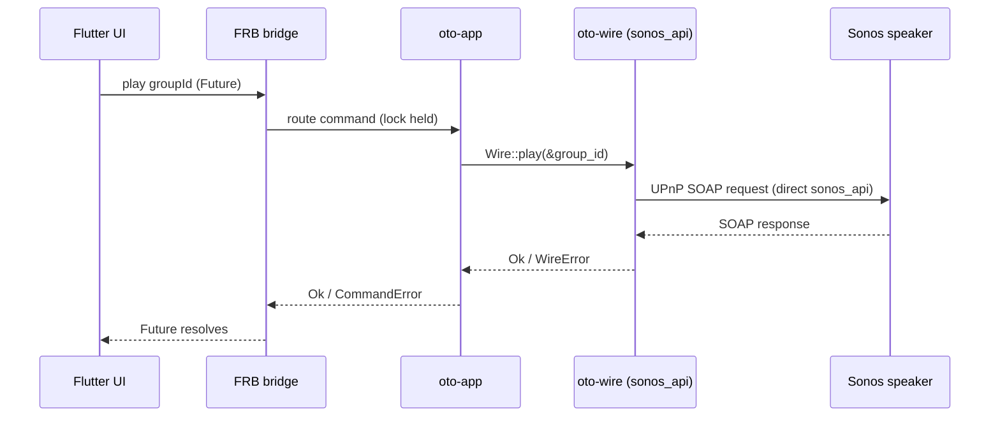
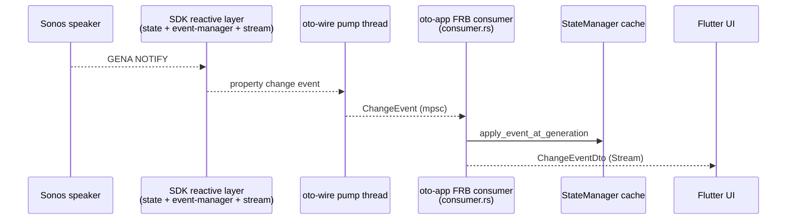

# Architecture

How oto is structured: a Flutter UI over a Rust core, with Sonos networking handled in Rust - SOAP via `sonos-api`, live events via the same SDK family's reactive layer, and discovery via oto's own multi-NIC SSDP.

Sibling docs: [ROADMAP.md](ROADMAP.md) for milestone status and forward plan; [sonos-notes.md](sonos-notes.md) for Sonos protocol / SDK reference.

## Layers

Solid arrows are command-direction (UI → FRB → ... → speakers); dashed arrows are event-direction (speakers → ... → UI). The event path is: GENA NOTIFY → SDK reactive layer → `oto-wire` pump thread → `oto-app` StateManager cache + FRB stream → Dart `ChangeEventDto` stream.

## Crates

| Crate | Path | Responsibility |
|---|---|---|
| `oto_native` | `native/` | FRB cdylib. Thin shim - `discover()` / `refresh_topology()` + non-sync commands (playback, group volume/mute, form/break, `track_position`) + identity/playback/event DTOs + `CommandError`; delegates to `oto-app`. Also exposes a `dev_*` mock-injection seam (`dev_discover_mock`, `dev_push_subscription_error_on_mock`, `dev_push_topology_change_on_mock`, a `MockWireArc` adapter) so `app/integration_test/` can drive the event surface without a LAN. The `pub fn` symbols are unconditional (FRB's generated glue references every one, so `cfg`-gating them would break the release cdylib's link), but each body is internally `cfg(debug_assertions)`-gated - inert (returns an error) in release builds, never touching the production wire. |
| `oto-app` | `native/crates/app` | Owns runtime state (the active `Wire` in a process-global, lock held across SOAP); routes `discover()` / `refresh_topology()`, the playback + group commands, and `track_position` reads. |
| `oto-core` | `native/crates/core` | Pure domain types (`Speaker`, `Group`, `TransportState`, `Track`, `Volume`, identifiers, `SpeakerState`, `SpeakerIdentity`, `GroupIdentity`, `DiscoverySnapshot`) + the `Wire` trait + `WireError`. No networking, no async, no third-party deps. |
| `oto-wire` | `native/crates/wire` | Production `Wire`: own multi-NIC SSDP + direct `sonos_api` (=0.8.0) SOAP for discovery, playback control, group operations (form/break + group volume/mute), and one-shot state reads; live property events use typed payloads from the aligned upstream reactive SDK crates. No `SonosSystem`. Interior-mutable id→addr / group→coordinator / speaker→coordinator cache populated by `discover()`. A no-SSDP seeded constructor (`new_seeded`) backs fast re-discover. |
| `oto-mock` | `native/crates/mock` | Stateful `Wire` implementation (`MockWire`) - in-memory per-speaker model (commands mutate it, `speaker_state` reflects it); integration tests run without a LAN. |

The Dart side is Flutter + Riverpod 3 (codegen). Providers live in `app/lib/src/state/`; FRB-generated bindings in `app/lib/src/rust/`.

## State ownership

Ownership is **split**. Rust owns the authoritative device state; Dart owns the accumulated view model the UI renders. Which layer is authoritative depends on the field:

| State | Authoritative owner | Notes |
|---|---|---|
| Topology (rooms, groups, membership, coordinator) | Rust (`oto-wire` caches, re-pulled by `discover()` / `refresh_topology()`) | Dart re-seeds its skeleton from every `discoveryProvider` transition. |
| Per-speaker volume / mute | Rust (`StateManager` cache in `oto-app`) | Event-fed; Dart mirrors them into `householdProvider` and can re-derive from a fresh event. |
| Transport state / current track | Rust (`StateManager` cache in `oto-app`) | Cached per **group**, fed by coordinator-only AVTransport events; `speaker_state` resolves speaker -> group to read it. |
| Track position / duration | Rust (`Wire::track_position`) | A live `GetPositionInfo` SOAP read, *not* in the event cache - no NOTIFY carries elapsed position. |
| Group volume / mute | Rust (`StateManager` cache in `oto-app`); Dart mirrors them | Event-fed. Rust caches both, but the current FRB surface exposes no getter, so `householdProvider` is the UI-readable copy. After an isolate restart Dart waits for the next seed / NOTIFY. |
| Per-speaker health (reachable / errored) | Rust | Surfaced as `SubscriptionError` / `SubscriptionRecovered`; Dart carries the flags forward across an automatic refresh and clears them on a `TopologySource.userScan` (see [Frontend shell](#frontend-shell)). |
| In-flight command failures | Dart (`commandFailuresProvider`) | Transient by design; see [Command flow](#command-flow). |
| UI preferences (theme, accent, home layout) | Dart, persisted to `shared_preferences` | Persisted along with desktop window bounds (see [Scope](#scope)). |

**Rust side.** `speaker_state` reads the `StateManager` cache in `oto-app`. The cache is event-fed: `oto-wire`'s pump thread converts GENA NOTIFYs (and SDK-internal polling for the few properties Sonos doesn't NOTIFY) into `ChangeEvent`s, the FRB consumer loop applies each to the cache, and `speaker_state` reads from there. The `Wire::speaker_state` trait method is preserved for hardware-baseline tests and `MockWire`'s own unit tests but is no longer dispatched in production.

**Dart side.** `householdProvider` is a keep-alive `Notifier` that seeds its skeleton from `discoveryProvider` and folds `changeEventsProvider` deltas on top through the pure `household_reducer`. It exists because the UI needs an accumulated per-room / per-group model that no single FRB read returns, and because the current FRB surface has no getter for Rust's cached group volume/mute.

Consequences:

- **Hot reload preserves both layers.** Hot restart recreates the Dart isolate and its accumulator; native state can remain until wire replacement. A process relaunch clears both. Dart needs discovery and event seeds to rebuild its view; it cannot recover group volume/mute through a bridge getter.
- A Rust client using `oto-app` can read its cached group volume/mute methods. A client limited to the current FRB surface must accumulate the event stream as Dart does because that surface exposes no getter for those fields.
- Device-state mutations happen where network events are handled (Rust), avoiding cross-FFI consistency bugs. Dart mutates its mirror only optimistically, and rolls back on a `CommandError` (see [Command flow](#command-flow)).
- **`speaker_state` is honest-partial during cold-start.** Fields for which no event has arrived yet are `None`; the SDK's initial SUBSCRIBE NOTIFY seeds the common case within ~1 s. An unknown speaker id still returns `WireError::NotFound` (topology is the source of truth for "is this id real?").
- **The cache is per-process and ephemeral** - cleared on every `discover_with` via a generation token, so a wire replacement can't leave stale state visible to the new wire's seeds.

## Command flow

**Commands are non-sync.** Every FRB *command* - `discover()` and all playback commands - is a default (non-sync) FRB fn returning a Dart `Future`, run off the UI isolate by FRB's worker executor. Each is a blocking SOAP round-trip (~tens–hundreds of ms), **except `speaker_state`, which is a fast in-memory read of the event-fed `StateManager` cache** (still surfaced as a `Future`; see [State ownership](#state-ownership)). The lone synchronous FRB fn is `current_wire_generation()` (`#[frb(sync)]`) - a cheap atomic read the Dart event-stream provider keys its re-subscription on; it is a getter, not a command.

**Discovery** blocks ~3–5 s (own multi-NIC SSDP + `GetZoneGroupState` SOAP to first responder), returns an identity snapshot with real group topology, and is idempotent (`oto-app` replaces the held `Wire` on success). It is **never on the `#[frb(init)]` path**.

**Playback commands** (`play/pause/next/previous` addressed by `GroupId`; `set_volume`/`set_mute` addressed by `SpeakerId`) are each a blocking SOAP round-trip via `sonos_api` directly - no `SonosSystem`. `oto-wire` resolves a `GroupId` → coordinator → `SocketAddr` from its interior-mutable cache (populated by `discover()`); a command before discovery, or for an unknown ID, returns `WireError::NotFound`. `speaker_state` (also `SpeakerId`-addressed) is **not** a SOAP call - it reads the `StateManager` cache (see [State ownership](#state-ownership)).

**Group addressing.** Discovery and fast topology refresh build group-to-coordinator and speaker-to-coordinator caches from `GetZoneGroupState`; `GroupId` resolution uses those caches.

**`speaker_state` addressing (D2).** Volume/mute are per-speaker (cached from `Volume` / `Mute` events); transport is per-group (cached from `Playback` / `Track` events at the group coordinator). The cache stores transport per `GroupId`; the read resolves speaker → group via the `StateManager`'s topology map (installed on every `discover_with`) → group transport cache. A solo speaker is its own coordinator, so the resolution degrades cleanly.

**Topology refresh.** The home shell watches `TopologyController`, which debounces `TopologyChanged` for 250 ms and requests `refresh_topology()`. This seeds a fresh wire from cached IPs without SSDP and installs it through `discover_with`; full discovery is the fallback. Before refresh, a stale group ID can still route to its former coordinator. After routing caches change, an unknown ID returns `NotFound`.

**Frontend command reconciliation.** Dart applies volume, mute, and transport
changes optimistically, then reconciles the FRB `Future` through one keep-alive
`CommandScheduler` shared by both controllers. Dispatch queues are keyed by the
physical speaker that receives SOAP; group commands capture the coordinator and
re-resolve the current group id immediately before dispatch and rollback. A
separate speaker-plus-operation-lane generation decides whether an older
failure has been superseded, and each lane retains its last successfully
committed rollback baseline. Cumulative commands are ordered without
superseding each other. A current `CommandError` rolls back and is reported
through the keep-alive `commandFailuresProvider`; the app-lifetime
`CommandFailureListener` renders one non-modal SnackBar per report. `NotFound`
always invalidates discovery, including for a superseded operation, because it
means the captured topology identifier is stale. The Rust slot still serializes
all actual `Wire` calls globally.

## Concurrency model

`sonos-api` command calls are sync-first at oto's boundary; event subscriptions add an upstream-managed runtime internally, but no async runtime is exposed at the FRB or `Wire` command surface.

Commands are non-sync FRB fns (Dart `Future`) into blocking `sonos_api` SOAP calls. `oto-app` holds its `Mutex<Option<...>>` **locked across the SOAP call** - deliberate: commands are user-initiated and low-frequency; serializing all commands is the LAN-politeness story (no command storms against the user's speakers). Revisit only if measured event/command contention requires it.

No async/await in oto's own surface code. Direct SOAP uses blocking ureq; the SDK reactive worker and callback server use Tokio internally. The architectural rule is that commands stay sync/blocking at the `Wire` boundary and event delivery is pumped by dedicated threads; tokio in the lockfile is not itself a violation.

## The `Wire` seam

`oto-app` depends on a `Wire` trait rather than on `sonos-api` or the SDK reactive layer directly. Production uses `oto-wire` (own SSDP + direct `sonos_api` SOAP + event subscriptions); tests use `oto-mock` (stateful in-memory fixtures). This keeps integration tests runnable without a Sonos device and isolates any future library swap to a single crate.

The canonical signatures live in [`oto-core`](../native/crates/core/src/wire.rs), and the exposed commands and DTOs live in [`api.rs`](../native/src/api.rs). Update this architecture document before extending the bridge surface.

The trait groups discovery/topology, playback, per-speaker and group controls, position reads, and event subscription. `subscribe_topology` must precede `subscribe_speakers`; `discover_with` enforces this. Each installed wire provides one event receiver.

`DiscoverySnapshot` is built from lean identity types (`SpeakerIdentity` / `GroupIdentity`).

**Discovery.** `oto-wire` runs its own multi-interface SSDP to collect responder IPs, then issues a direct `sonos_api` `GetZoneGroupState` SOAP call to any responding speaker to retrieve the full household topology. The snapshot is built from ZoneGroupTopology members; `<Satellite Invisible="1">` children are folded into their primary speaker and never surfaced as standalone players; `<VanishedDevices>` are ignored. The direct discovery/control path uses `sonos-api =0.8.0` (+ `quick-xml =0.31.0` for DIDL-Lite), aligned with the upstream reactive SDK crates. All resolve from crates.io: SDK 0.8 removed the dependencies that required the TLS fork. Upstream discovery now probes per interface, but oto retains explicit multicast egress selection and a single absolute receive deadline. Protocol detail: [sonos-notes.md § SSDP discovery](sonos-notes.md#ssdp-discovery), [§ Topology](sonos-notes.md#topology---getzonegroupstate-soap).

**Playback control.** `oto-wire` holds an interior-mutable id→addr / group→coordinator / speaker→coordinator cache (populated by `discover()`). Commands issue direct `sonos_api::SonosClient::execute_enhanced(ip, op)` SOAP calls. `quick-xml` is used for DIDL-Lite track-metadata parsing.

## Live events

`oto-wire` runs a dedicated pump thread per active wire
(`crates/wire/src/events.rs`). The pump wraps the upstream SDK's `StateManager` +
`SonosEventManager` + `EventBroker` stack (`sonos-sdk-state` /
`sonos-sdk-event-manager` / `sonos-sdk-stream` /
`sonos-sdk-callback-server`, all pinned `=0.8.0`). It creates the iterator before
registering any `watch_property_with_subscription`: SDK 0.8 has no event replay,
so subscribing later could lose initial NOTIFYs. It then converts each
upstream typed property payload into an `oto_core::ChangeEvent` that it sends down an
unbounded `std::sync::mpsc` channel. Dropping the wire performs two distinct
shutdown steps. First, `EventPump::Drop` explicitly calls
`SonosEventManager::shutdown()` to break the SDK worker's self-owned `Arc` cycle
and let its reactive stack release asynchronously. It then sets an
`Arc<AtomicBool>` stop flag and joins oto's pump thread within one polling
interval. Both steps remain load-bearing: SDK 0.8 manager clones share the
event fanout, so dropping a clone neither closes the pump channel nor asks
the SDK worker to stop. Mapping uses each event's observed value rather than
re-reading the mutable SDK cache, preserving queued intermediate transitions.

The Dart `changeEventsProvider` (a Riverpod `StreamProvider`) re-subscribes when a NEW wire is installed - keyed on the **wire generation** (`current_wire_generation()`, bumped by `discover_with` on success only), not raw discovery state. A *failed* re-discover keeps the old wire (whose event receiver is one-shot and can't be retaken), so gating on the generation avoids tearing the live stream down onto a dead receiver. The same `StateManager` generation makes stale-OLD-wire cache applies after a mid-stream `discover_with` no-op against the freshly-cleared cache.

The same single FRB stream also carries:

- **Topology events.** The pump also registers a per-speaker
  `GroupMembership` watch. ZoneGroupTopology is a *service*, not a watchable
  property; the change surfaces through the speaker-scoped `GroupMembership`
  property (see
  [sonos-notes § Topology change events](sonos-notes.md#topology-change-events)).
  A regroup produces a payload-less `ChangeEvent::TopologyChanged`; the Dart
  `TopologyController` debounces 250 ms, then refreshes via the
  no-SSDP `refresh_topology()` path, with full re-discovery as the fallback.
  Two pump-side guards make this safe:

  1. The first `GroupMembership` per speaker inside the short post-spawn seed
     window is suppressed. Otherwise seed → re-discover → new pump → new seed
     would loop forever. A first event after the window is treated as a real
     regroup, so a missed seed cannot permanently swallow a later change.
  2. A real regroup marks the pump's frozen coordinator→group routing `dirty`
     and temporarily drops group-addressed
     `Playback`/`Track`/`GroupVolume`/`GroupMute` events. Normally the debounced
     fast refresh, or its full re-discover fallback, installs a fresh pump with
     clean routing and clears `dirty`. If both paths fail, `DIRTY_TIMEOUT`
     clears `dirty` after 60 s (checked lazily on the next event), bounding
     suppression and accepting possibly stale routing rather than permanent
     silence.

  `refresh_topology` replaces the complete wire through `discover_with`, so the
  new pump starts with a clean `TopologyFilter`; it never mutates the old
  pump's frozen maps in place. Dart forces the event-stream re-subscribe by
  bumping the wire-install signal `wireGenerationProvider` watches, so the
  re-subscribe does not depend on whether the published topology compares equal.
- **Group volume/mute events.** The pump watches `GroupVolume` / `GroupMute` (GroupRenderingControl, coordinator-routed like AVTransport) and emits `ChangeEvent::{GroupVolume, GroupMute}` from the SDK's typed payload. No per-speaker or group cache lookup is needed. Coordinator filtering and post-regroup stale-group suppression still apply (see [sonos-notes § Group operations](sonos-notes.md#group-operations)).
- **Subscription health.** `SubscriptionError` / `SubscriptionRecovered` are emitted reactively from command dispatch (`oto-app` tracks per-speaker `Healthy ↔ Errored`) onto a *separate* app-event `mpsc` bus that the FRB consumer drains alongside the wire channel. App events are stamped with the wire generation; the consumer drops stale-stamped events so a lingering old-wire health event can't surface on the new stream.

## Frontend shell

The Flutter shell is responsive over the same providers (no backend change). Layout keys off three width tiers from one helper - `LayoutTier` in `app/lib/src/state/breakpoints.dart`, read from `MediaQuery` so `OtoScaffold` and the leaf widgets share a single source of truth: compact (`<840`), tablet (`840-1200`), desktop (`>=1200`).

- **`OtoScaffold`** carries optional `detail` + `rail` slots. Compact renders the phone body unchanged; wide renders the room grid beside a persistent Now Playing pane; desktop adds a leading nav rail (a three-pane layout).
- **Selection.** `selectedSourceProvider` (the explicit pick) + `resolvedSourceProvider` (default = first active source, self-healing when a regroup drops the chosen id) drive the pane. On wide, tapping a room/group selects it in place; on phone the existing route pushes are kept. A single tier-aware `nav.dart` helper makes that choice per width.
- **Routing architecture decision.** Imperative routing (`Navigator.of(context).push`) is used for phone detail screens. Using `go_router` was deliberately decided against due to refactoring complexity, YAGNI (no deep linking or web browser history requirements), and to keep the codebase simple. Dynamically popped routes handle dynamic window resizing instead.
- **`*Body` / `*Screen` split.** Detail screens split into a chrome-free `*Body` (embeddable in the pane or a dialog) and a thin `*Screen` route wrapper for phone. On wide, Now Playing renders in the pane, Settings and the group editor open as dialogs, and Room detail is folded away - a wide room tap selects its group into the pane, so the room screen is unreachable there.
- **Mute surfaces.** One shared `MuteButton` fronts the existing
  per-speaker and group-master command paths wherever a volume control appears:
  room cards/rows/detail, group cards, and Now Playing. It consumes the
  event-fed nullable mute state and follows the same reachability gate as the
  adjacent volume control.
- **Unreachable recovery.** `HomeAllUnreachable` keeps the cached
  household visible but adds a rescan affordance. A user-requested scan clears
  carried health errors; automatic topology refresh preserves them. UI copy
  says "Unreachable" because command-time network failure cannot establish
  device power state.
- **Room options on wide.** A solo room shown in the persistent Now
  Playing pane exposes the shared `RoomOptionsButton`; group controls no longer
  disappear merely because Room detail is folded away.
- **Window bounds.** On desktop the window's size/position persists across launches via `window_manager` (best-effort, desktop-guarded; a no-op on Android).

## Scope

- **Targets:** Android (API 35+, 64-bit) and Windows. Other platform folders are scaffolding, not supported or routinely validated targets.
- **Local-first:** LAN-only. No cloud, no account, no Sonos HTTP API.
- **No persistence of device/LAN state** - no speaker, topology, or live state is written to disk; all of it is in-process and rebuilt by discovery. Local UI preferences (theme mode, accent, home layout) and desktop window bounds are persisted; nothing about the user's Sonos system is stored.

## Known constraints

- **Event initialization and teardown ordering.** Attach the SDK event manager, initialize topology, attach the iterator before watches, and explicitly shut down the SDK worker before joining oto's pump. See [live events](#live-events) and [Sonos event notes](sonos-notes.md#event-model).
- **Android multicast.** `MulticastLockHandler` holds a Wi-Fi multicast lock around discovery through the `me.oszkar.oto/multicast_lock` MethodChannel. Acquisition is best-effort. Historical debug success without the lock does not establish release reliability; GENA itself uses unicast TCP.
- **SSDP response validation is incomplete.** Discovery accepts any datagram carrying a `LOCATION` header - it does not validate the status line / `ST`, match the LOCATION host to the responder's source IP, or cap the candidate count. A hostile device on the user's LAN could therefore redirect discovery's follow-up `GetZoneGroupState` SOAP to an arbitrary host (port 1400 only). LAN-local and low-impact: a non-Sonos host fails to parse and is skipped, and `discover()` stops at the first responder that returns a parseable topology. Hardening (200 + `ST` + sender-IP match + candidate cap) is tracked for v0.7 (the hardening + polish bucket) - see the SSDP-hardening `TODO` in `native/crates/wire/src/ssdp.rs`.
