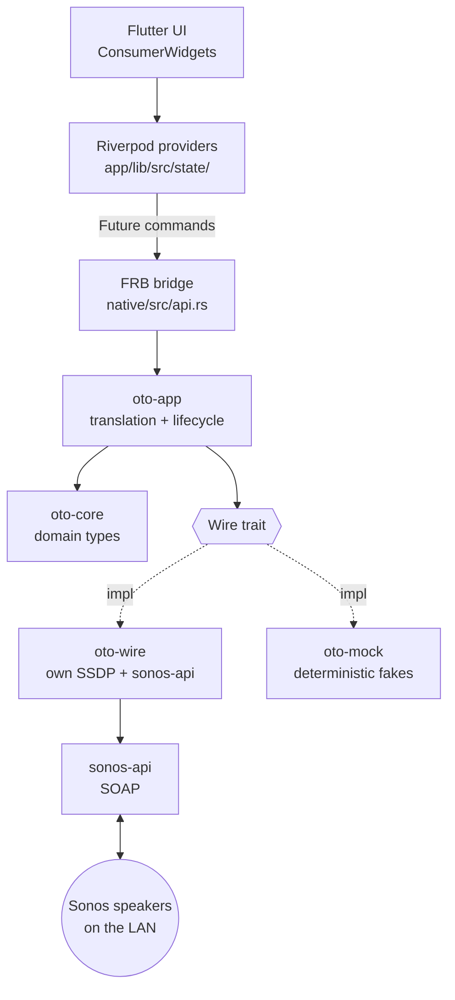
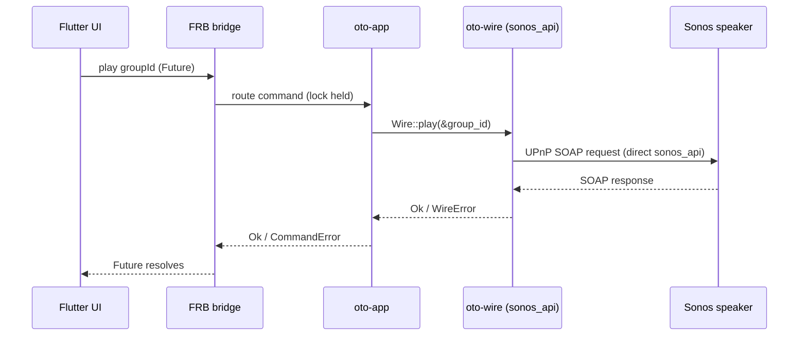

# Architecture

How oto is structured: a Flutter UI over a Rust core, with Sonos networking handled in Rust — SSDP and SOAP via `sonos-api` and oto's own multi-NIC SSDP.

Sibling docs: [ROADMAP.md](ROADMAP.md) for milestone status and forward plan; [sonos-notes.md](sonos-notes.md) for Sonos protocol / SDK reference.

## Layers



## Crates

| Crate | Path | Responsibility |
|---|---|---|
| `oto_native` | `native/` | FRB cdylib. Thin shim — `discover()` + 7 non-sync playback commands + identity/playback DTOs + `CommandError`; delegates to `oto-app`. |
| `oto-app` | `native/crates/app` | Owns runtime state (the active `Wire` in a process-global, lock held across SOAP); routes `discover()` and the 7 playback/state commands. |
| `oto-core` | `native/crates/core` | Pure domain types (`Speaker`, `Group`, `TransportState`, `Track`, `Volume`, identifiers, `SpeakerState`, `SpeakerIdentity`, `GroupIdentity`, `DiscoverySnapshot`) + the `Wire` trait + `WireError`. No networking, no async, no third-party deps. |
| `oto-wire` | `native/crates/wire` | Production `Wire`: own multi-NIC SSDP + direct `sonos_api` (=0.5.2) SOAP — `ZoneGroupTopology` (`GetZoneGroupState`) for discovery and group/coordinator mapping; AVTransport / RenderingControl for playback control and state reads. No `SonosSystem`, no `sonos-sdk` umbrella. Interior-mutable id→addr / group→coordinator / speaker→coordinator cache populated by `discover()`. |
| `oto-mock` | `native/crates/mock` | Stateful `Wire` implementation (`MockWire`) — in-memory per-speaker model (commands mutate it, `speaker_state` reflects it); integration tests run without a LAN. |

The Dart side is Flutter + Riverpod 3 (codegen). Providers live in `app/lib/src/state/`; FRB-generated bindings in `app/lib/src/rust/`.

## State ownership

State lives in Rust, not Dart. Each `speaker_state` call today is a one-shot SOAP read; the impl will swap to an event-fed cache in v0.4, with the `Wire` signature unchanged (see [ROADMAP § v0.4](ROADMAP.md#v04--live-events)).

Consequences:

- State survives Flutter hot reload / UI restart.
- A non-Flutter client (e.g. a CLI) could reuse the same core unchanged.
- State mutations happen where network events are handled (Rust), avoiding cross-FFI consistency bugs.

## Command flow

**All commands are non-sync.** Every FRB function — including `discover()` and all playback commands — is a default (non-sync) FRB fn returning a Dart `Future`, run off the UI isolate by FRB's worker executor. Every command is a blocking SOAP round-trip (~tens–hundreds of ms); there are no synchronous commands in the FRB surface.

**Discovery** blocks ~3–5 s (own multi-NIC SSDP + `GetZoneGroupState` SOAP to first responder), returns an identity snapshot with real group topology, and is idempotent (`oto-app` replaces the held `Wire` on success). It is **never on the `#[frb(init)]` path**.

**Playback commands** (`play/pause/next/previous` addressed by `GroupId`; `set_volume`/`set_mute`/`speaker_state` addressed by `SpeakerId`) are each a blocking SOAP round-trip via `sonos_api` directly — no `SonosSystem`. `oto-wire` resolves a `GroupId` → coordinator → `SocketAddr` from its interior-mutable cache (populated by `discover()`); a command before discovery, or for an unknown ID, returns `WireError::NotFound`.

**Group addressing.** `discover()` reads `GetZoneGroupState` from any responding speaker and builds the group→coordinator / speaker→coordinator caches; `GroupId` resolution uses those caches. `Wire` signatures are stable across the v0.2 group-of-one → v0.3 real-topology change (the seam was designed for this).

**`speaker_state` addressing (D2).** Reads volume/mute at the speaker's own address; reads transport (`GetTransportInfo` / `GetPositionInfo`) at the group coordinator's address, resolved via the `speaker_to_coordinator` cache. A solo speaker is its own coordinator, so the behavior degrades cleanly.

**Topology refresh is one-shot.** Caches are populated only by `discover()`. App-side regrouping changes a group's opaque `N` suffix in `GroupId = RINCON_<coord>:N`; a stale `GroupId` returns `WireError::NotFound`. Live topology-change events are v0.4.

**State-read shape (`speaker_state`).** `SpeakerState { volume: Option<Volume>, muted: Option<bool>, transport: Option<TransportState> }`. `Option<T>` fields are honest partial failure — a snapshot does ~4 SOAP calls and any may fail independently. The shape was chosen because (a) it mirrors the proven `discover → snapshot → FutureProvider` pattern, (b) it's the smallest `Wire` seam, and (c) the signature survives the v0.4 fetch→event-cache swap unchanged.



## Concurrency model

`sonos-api` is sync-first; no async runtime is required at the bridge.

Commands are non-sync FRB fns (Dart `Future`) into blocking `sonos_api` SOAP calls. `oto-app` holds its `Mutex<Option<…>>` **locked across the SOAP call** — deliberate: commands are user-initiated and low-frequency; serializing all commands is the LAN-politeness story (no command storms against the user's speakers). Revisit only if v0.4 event threads and commands contend on the lock.

No `tokio` in oto's own code. `sonos-api` uses async internally; that is encapsulated and does not surface at the `Wire` boundary.

## The `Wire` seam

`oto-app` depends on a `Wire` trait rather than on `sonos-api` directly. Production uses `oto-wire` (own SSDP + direct `sonos_api` SOAP); tests use `oto-mock` (stateful in-memory fixtures). This keeps integration tests runnable without a Sonos device and isolates any future library swap to a single crate.

```rust
pub trait Wire {
    fn discover(&self) -> Result<DiscoverySnapshot, WireError>;

    // Playback — addressed by GroupId (Sonos plays per-coordinator).
    fn play(&self, group: &GroupId) -> Result<(), WireError>;
    fn pause(&self, group: &GroupId) -> Result<(), WireError>;
    fn next(&self, group: &GroupId) -> Result<(), WireError>;
    fn previous(&self, group: &GroupId) -> Result<(), WireError>;

    // Per-speaker controls.
    fn set_volume(&self, speaker: &SpeakerId, volume: Volume) -> Result<(), WireError>;
    fn set_mute(&self, speaker: &SpeakerId, muted: bool) -> Result<(), WireError>;

    // One-shot snapshot read.
    fn speaker_state(&self, speaker: &SpeakerId) -> Result<SpeakerState, WireError>;
}
```

`DiscoverySnapshot` is built from lean identity types (`SpeakerIdentity` / `GroupIdentity`).

**Discovery.** `oto-wire` runs its own multi-interface SSDP to collect responder IPs, then issues a direct `sonos_api` `GetZoneGroupState` SOAP call to any responding speaker to retrieve the full household topology. The snapshot is built from ZoneGroupTopology members; `<Satellite Invisible="1">` children are folded into their primary speaker and never surfaced as standalone players (the v0.1 bonded-as-standalone bug is fixed by construction); `<VanishedDevices>` are ignored. `oto-wire` depends only on `sonos-api =0.5.2` (+ `quick-xml =0.31.0` for DIDL-Lite). Protocol detail: [sonos-notes.md § SSDP discovery](sonos-notes.md#ssdp-discovery), [§ Topology](sonos-notes.md#topology--getzonegroupstate-soap).

**Playback control.** `oto-wire` holds an interior-mutable id→addr / group→coordinator / speaker→coordinator cache (populated by `discover()`). Commands issue direct `sonos_api::SonosClient::execute_enhanced(ip, op)` SOAP calls. `quick-xml` is used for DIDL-Lite track-metadata parsing.

## Scope

- **Targets:** Android (API 35+, 64-bit) and Windows. Other platforms compile but are untested.
- **Local-first:** LAN-only. No cloud, no account, no Sonos HTTP API.
- **No persistence** — no on-disk state or config; all state is in-process.

## Known constraints

- **Watch-after-fetch event suppression (v0.4-relevant).** Upstream change-detection suppresses the initial `.watch()` notification if a prior `.fetch()` already cached the same value (documented upstream as by-design). The natural fetch-then-subscribe pattern will silently miss the first event. v0.4 constraint: treat `.watch()` itself as the reachability/seed probe. Detail and the v0.4 fallback strategy live in [sonos-notes.md § Event model](sonos-notes.md#event-model-v04-load-bearing) and [ROADMAP § v0.4](ROADMAP.md#v04--live-events).
