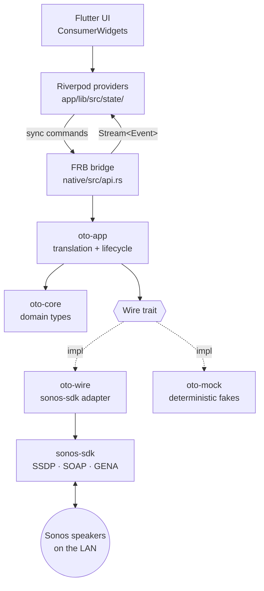
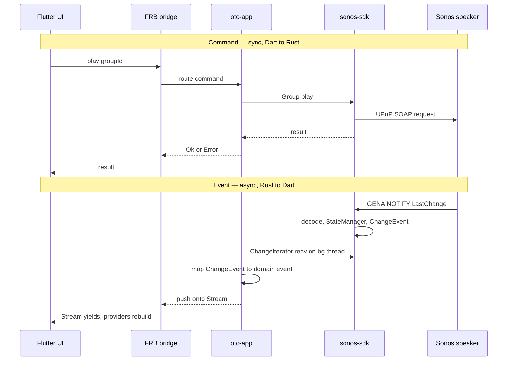

# Architecture

How oto is structured: a Flutter UI over a Rust core, with all Sonos
networking delegated to [`tatimblin/sonos-sdk`][sdk].

> **Status — this is the target design, not current code.** Implemented
> today: `oto-core` (domain types) and the `oto-wire` skeleton (a
> `sonos-sdk` dependency pin + link check). Not yet built: the `Wire`
> trait, `oto-app`, the `oto-mock` fixtures, and the FRB command/event
> surface. Inline notes and the Crates table mark what exists vs. what's
> planned. Prose describes the intended design; it is not a claim that
> the code exists today.

## Layers

## Crates

| Crate | Path | Responsibility |
|---|---|---|
| `oto_native` | `native/` | FRB cdylib. Thin shim — exposes commands and event streams to Dart, delegates everything else. |
| `oto-app` | (not yet created) | Owns the `SonosSystem` instance and the background threads that pump events. Translates `sonos_sdk` types ↔ `oto_core` types. Routes commands. |
| `oto-core` | `native/crates/core` | Pure domain types (`Speaker`, `Group`, `TransportState`, `Track`, `Volume`, identifiers). No networking, no async, no third-party deps. |
| `oto-wire` | `native/crates/wire` | _Planned:_ production `Wire` implementation backed by `sonos-sdk`. _Today:_ skeleton — dependency pin + link check, no adapter or trait yet. |
| `oto-mock` | `native/crates/mock` | _Planned:_ `Wire` implementation with deterministic in-memory fixtures, for tests without a LAN. _Today:_ placeholder stub only. |

The Dart side is Flutter + Riverpod 3 (codegen). Providers live in
`app/lib/src/state/`; FRB-generated bindings in `app/lib/src/rust/`.

## State ownership

State lives in Rust, not Dart. `sonos-sdk`'s `StateManager` caches
per-speaker and per-group properties and emits `ChangeEvent`s on change.
`oto-app` holds the `SonosSystem`; Dart Riverpod providers subscribe to
event streams and hold projections for rendering, not source data.

Consequences:

- State survives Flutter hot reload / UI restart.
- A non-Flutter client (e.g. a CLI) could reuse the same core unchanged.
- State mutations happen where network events are handled (Rust), avoiding
  cross-FFI consistency bugs.

## Command and event flow

Commands are synchronous Dart → Rust calls returning `Result`. Events are
an asynchronous Rust → Dart stream. The two are independent: a command's
success/failure is separate from the state change it eventually causes.

## Concurrency model

`sonos-sdk` is sync-first; no async runtime is required at the bridge.

- Commands: synchronous FRB calls into synchronous `sonos-sdk` methods.
- Events: `sonos-sdk`'s `ChangeIterator::recv()` blocks. Each event stream
  exposed to Dart is pumped by a dedicated OS thread that reads the
  iterator and pushes onto an FRB `Stream`.

No `tokio` in oto's own code. (`sonos-sdk` uses async internally; that is
encapsulated and does not surface at the `Wire` boundary.)

## The `Wire` seam

_Planned; none of the `Wire` trait, `oto-app`, or the impls below exist
yet — see the Status note above._

`oto-app` will depend on a `Wire` trait rather than on `sonos-sdk`
directly. Production will use `oto-wire` (a thin shim over `sonos-sdk`);
tests will use `oto-mock` (deterministic fixtures). This keeps
integration tests runnable without a Sonos device on the network and
isolates any future library swap to a single crate.

**Discovery.** `sonos-sdk`'s built-in SSDP binds to `0.0.0.0` and fails on
multi-NIC hosts (e.g. Windows with a WSL/Hyper-V vEthernet) — see
[discovery spike findings](plans/2026-05-15-discovery-spike-findings.md).
`oto-wire` therefore runs its own multi-interface SSDP and constructs the
system via `SonosSystem::from_discovered_devices` (behind `sonos-sdk`'s
`test-support` feature; `sonos-sdk` pinned `=0.5.2` while we depend on
that API). An upstream fix is tracked so the workaround can be dropped.

## Scope

- **Targets:** Android (API 35+, 64-bit) and Windows. Other platforms
  compile but are untested.
- **Local-first:** LAN-only. No cloud, no account, no Sonos HTTP API.
- **No persistence** beyond what `sonos-sdk` caches in memory. No on-disk
  state or config yet.

## Open questions

Progress tracked against the
[discovery spike findings](plans/2026-05-15-discovery-spike-findings.md).

1. **ZoneGroupTopology coverage.** _Still open._ Static group/standalone
   reporting works; whether `sonos-sdk` emits topology-*change* events
   (group form/break, coordinator change) is unverified — needs the
   Phase-2 spike with explicit `.watch()`. Historical weak spot; validate
   before relying on it.
2. **Discovery blocking on startup.** _Resolved:_ `SonosSystem::new()`
   blocks ~3–4.6s even on a healthy network. Off the FRB `init_app` path;
   needs a deferred warm-up command and a UI loading state.
3. **Thread count.** _Informed:_ events are opt-in via `.watch()`, so
   stream granularity is a deliberate design choice (favour one
   multiplexed event stream → one pump thread, not one per speaker).
4. **Bonded / satellite / asleep units.** _New, open._ Spike saw fewer
   speakers than the router's Sonos count (a unit SSDP-silent on two
   platforms; another SSDP-visible but not surfaced by `sonos-sdk`).
   Likely bonded/satellite or sleeping devices. Ties to the bonded-speaker
   question deferred in oto-core; revisit during the discovery slice.

## Related docs

- `docs/plans/2026-05-15-oto-core-domain-types-design.md` — rationale for
  the `oto-core` type shapes (newtypes, transport-on-`Group`, etc.).

[sdk]: https://github.com/tatimblin/sonos-sdk
