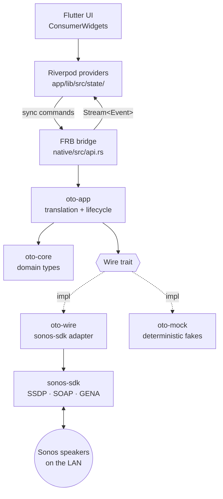
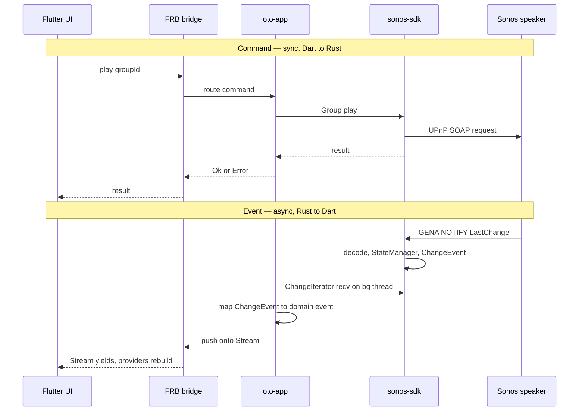

# Architecture

How oto is structured: a Flutter UI over a Rust core, with all Sonos
networking delegated to [`tatimblin/sonos-sdk`][sdk].

> **Status.** v0.1 (Foundation + LAN **discovery**) is **implemented**
> and hardware-verified: `oto-core` domain + identity types, the `Wire`
> trait, `oto-wire` (own multi-NIC SSDP + `ureq` device-description
> fetch), `oto-mock`, `oto-app`, and the FRB `discover` surface all
> exist. **v0.1 deviation from the prose below:** the v0.1 identity
> snapshot is built directly from `oto-wire`'s own discovered device
> descriptions — it does **not** use `SonosSystem` /
> `from_discovered_devices` or `sonos-sdk`'s ZoneGroupTopology, which
> hardware proved lazy / lossy / non-deterministic (see **Open Q1** and
> the [discover design](plans/2026-05-15-frb-discover-command-design.md)
> addendum). The `SonosSystem` / `StateManager` / `ChangeIterator` /
> event prose below (State ownership, Concurrency, the sequence diagram)
> describes the **v0.2 / v0.3 target**, not current code. The Crates
> table marks what exists.

## Layers



## Crates

| Crate | Path | Responsibility |
|---|---|---|
| `oto_native` | `native/` | FRB cdylib. Thin shim — `discover()` + identity DTOs; delegates to `oto-app`. (v0.2/v0.3: event streams.) |
| `oto-app` | `native/crates/app` | Owns runtime state (the active `Wire` in a process-global); routes `discover()`. (v0.2: owns `SonosSystem` for playback; v0.3: event pump threads.) |
| `oto-core` | `native/crates/core` | Pure domain types (`Speaker`, `Group`, `TransportState`, `Track`, `Volume`, identifiers) + v0.1 identity types (`SpeakerIdentity`, `GroupIdentity`, `DiscoverySnapshot`) + the `Wire` trait + `WireError`. No networking, no async, no third-party deps. |
| `oto-wire` | `native/crates/wire` | Production `Wire`: own multi-NIC SSDP, `ureq` device-description fetch (Sonos serves HTTP/1.1 chunked), `sonos_discovery::DeviceDescription` parse, identity-snapshot mapping. `=0.5.2` pin / `test-support` feature for `sonos_discovery::{Device,DeviceDescription}`. |
| `oto-mock` | `native/crates/mock` | `Wire` implementation (`MockWire`) with deterministic in-memory fixtures — integration tests run without a LAN. |

The Dart side is Flutter + Riverpod 3 (codegen). Providers live in
`app/lib/src/state/`; FRB-generated bindings in `app/lib/src/rust/`.

## State ownership

State lives in Rust, not Dart. `sonos-sdk`'s `StateManager` caches
per-speaker and per-group properties and emits `ChangeEvent`s on change.
`oto-app` holds the `SonosSystem`; Dart Riverpod providers subscribe to
event streams and hold projections for rendering, not source data.

Consequences:

- State survives Flutter hot reload / UI restart.
- A non-Flutter client (e.g. a CLI) could reuse the same core unchanged.
- State mutations happen where network events are handled (Rust), avoiding
  cross-FFI consistency bugs.

## Command and event flow

Commands are synchronous Dart → Rust calls returning `Result`. Events are
an asynchronous Rust → Dart stream. The two are independent: a command's
success/failure is separate from the state change it eventually causes.

**Discovery is the documented exception to "commands sync."** It blocks
~3–5 s (own multi-NIC SSDP + chunked-HTTP device-description fetches via
`ureq` + identity mapping), so `discover()` is a *deferred warm-up*
command — a default (non-sync) FRB fn returning a Dart `Future<Topology>`,
run off the UI isolate by FRB's worker executor, and **never on the
`#[frb(init)]` path**. It returns an identity-only snapshot (no
volume/transport at v0.1) and is idempotent (re-callable;
`oto-app` replaces the held `Wire` on success). Rationale, the rejected
stream/poll alternatives, and the hardware-driven changes (chunked→`ureq`;
snapshot from own devices not sonos-sdk topology):
[FRB discover command design](plans/2026-05-15-frb-discover-command-design.md)
(see its Addendum).



## Concurrency model

`sonos-sdk` is sync-first; no async runtime is required at the bridge.

- Commands: synchronous FRB calls into synchronous `sonos-sdk` methods.
- Events: `sonos-sdk`'s `ChangeIterator::recv()` blocks. Each event stream
  exposed to Dart is pumped by a dedicated OS thread that reads the
  iterator and pushes onto an FRB `Stream`.

No `tokio` in oto's own code. (`sonos-sdk` uses async internally; that is
encapsulated and does not surface at the `Wire` boundary.)

## The `Wire` seam

_Implemented for v0.1 — see the Status note and the
[FRB discover command design](plans/2026-05-15-frb-discover-command-design.md)
(+ Addendum for the hardware-driven changes)._

`oto-app` depends on a `Wire` trait rather than on `sonos-sdk`
directly. Production uses `oto-wire` (own SSDP + `sonos-sdk` device-XML
parsing); tests use `oto-mock` (deterministic fixtures). This keeps
integration tests runnable without a Sonos device on the network and
isolates any future library swap to a single crate.

For v0.1 the trait is **minimal — one identity-only method**:

```rust
pub trait Wire {
    fn discover(&self) -> Result<DiscoverySnapshot, WireError>;
}
```

`DiscoverySnapshot` is built from lean identity types added to
`oto-core` (`SpeakerIdentity` / `GroupIdentity`) — not `Speaker` /
`Group`, whose `volume` / `transport` fields are unpopulated
post-discovery (spike finding). v0.2 grows `Speaker` *around*
`SpeakerIdentity` rather than retrofitting.

**Discovery (v0.1, as implemented).** `sonos-sdk`'s built-in SSDP binds
to `0.0.0.0` and fails on multi-NIC hosts (e.g. Windows with a
WSL/Hyper-V vEthernet) — see
[discovery spike findings](plans/2026-05-15-discovery-spike-findings.md).
`oto-wire` runs its own multi-interface SSDP, fetches each device
description over HTTP (Sonos serves **HTTP/1.1 chunked**, so a raw socket
won't do — `ureq`, already a locked transitive dep, handles it), parses
it with `sonos_discovery::DeviceDescription::from_xml`, and maps the
resulting `Device`s **directly** to the identity `DiscoverySnapshot`.
v0.1 does **not** call `SonosSystem::from_discovered_devices` or rely on
`sonos-sdk`'s ZoneGroupTopology (hardware-proven lazy/non-deterministic —
Open Q1); that path returns for v0.2 (playback) / v0.3 (real grouping +
events). The `test-support` feature is still required (it gates
`sonos_discovery::{Device, DeviceDescription}`); `sonos-sdk` stays pinned
`=0.5.2`. An upstream SSDP fix is tracked so that workaround can be
dropped.

## Scope

- **Targets:** Android (API 35+, 64-bit) and Windows. Other platforms
  compile but are untested.
- **Local-first:** LAN-only. No cloud, no account, no Sonos HTTP API.
- **No persistence** beyond what `sonos-sdk` caches in memory. No on-disk
  state or config yet.
- **v0.1 verified on Windows** (Rust bridge — the milestone bar). The
  Android main manifest declares `INTERNET` +
  `CHANGE_WIFI_MULTICAST_STATE`, but Android silently drops SSDP
  multicast without a held `WifiManager.MulticastLock`; that platform
  code is deferred (`TODO(v0.4)`, `native/src/api.rs`). Android
  **release** discovery is therefore non-functional until v0.4; the
  debug APK works (Flutter tooling supplies `INTERNET`). A documented
  v0.1 limitation, like the bonded-surround case in Open Q4.

## Open questions

Progress tracked against the
[discovery spike findings](plans/2026-05-15-discovery-spike-findings.md).

1. **ZoneGroupTopology coverage.** _Validated on hardware (Task 8) —
   confirmed weak; v0.1 no longer relies on it._ Feeding `sonos-sdk`'s
   `SonosSystem::from_discovered_devices` our 4 discovered devices, its
   post-discovery `speakers()`/`groups()` (topology-poll backed) returned
   only **1** speaker and was **non-deterministic** (flapped 0↔1) — the
   lazy/partial population the spike warned about. v0.1 therefore builds
   the identity snapshot directly from `oto-wire`'s own device
   descriptions and does not touch sonos-sdk topology. Real
   ZoneGroupTopology (multi-room groups, coordinators, topology-*change*
   events) is **v0.3** — re-evaluate the SDK's topology/`.watch()` path
   then; it remains the historical weak spot.
2. **Discovery blocking on startup.** _Resolved:_ `SonosSystem::new()`
   blocks ~3–4.6s even on a healthy network. Off the FRB `init_app` path;
   needs a deferred warm-up command and a UI loading state.
3. **Thread count.** _Informed:_ events are opt-in via `.watch()`, so
   stream granularity is a deliberate design choice (favour one
   multiplexed event stream → one pump thread, not one per speaker).
4. **Bonded / satellite / asleep units.** _Confirmed on hardware._ The
   Task-8 LAN has a SYMFONISK Bookshelf stereo pair acting as Living-Room
   Beam surrounds: own-SSDP correctly finds all 4 device descriptions, so
   v0.1 (identity from own devices) lists all 4 — meaning **bonded
   surrounds appear as standalone players** in v0.1. This is a documented,
   accepted v0.1 limitation: distinguishing bonded/satellite/invisible
   units needs ZoneGroupTopology, deferred with Q1 to **v0.3** (ties to
   the bonded-speaker question deferred in oto-core).
5. **`sonos-sdk` dependency direction.** _Decided (2026-05-17 source
   review): keep the umbrella `sonos-sdk` + `test-support`._ v0.1 uses
   only `sonos_discovery::{Device, DeviceDescription}` (pure serde, zero
   networking) yet links the whole tree (`sonos-state/-api/-event-manager
   /-stream`, `reqwest`, `tokio`). The source crate `sonos-sdk-discovery`
   exposes those two types publicly *without* the `test-support` gate, so
   a v0.1-only build could depend on it directly. Rejected: v0.2
   (playback) needs the umbrella regardless, so switching now + reverting
   is churn; the real cost of keeping is build-time / supply-chain audit
   scope, not stripped APK size (LTO dead-strips unused Rust). The
   `=0.5.2` pin neutralises the non-semver `test-support` fragility.
   `// TODO(v0.2):` confirm the umbrella is genuinely consumed once
   playback lands so the unused-tree state stays explicitly temporary.
6. **`watch()`-after-`fetch()` event suppression (v0.2/v0.3 constraint).**
   _Open — design constraint, not a bug._ Upstream change-detection
   suppresses the initial `.watch()` notification if a prior `.fetch()`
   already cached the same value (documented upstream as by-design;
   unlikely to change). The natural oto pattern — fetch initial state,
   then subscribe — will silently miss the first event. Constraint for
   v0.2/v0.3: treat `.watch()` itself as the reachability/seed probe;
   do not rely on a post-`fetch()` watch firing an initial event.
7. **Event-path reliability is the v0.3 risk; contingency is narrowing,
   not forking.** _Tracked._ Upstream's reactive layer (`sonos-state/
   -stream/-event-manager`) carries the only live correctness concern
   (intermittent `position` updates, open upstream) and has no upstream
   CI integration coverage (all hardware-gated). The lower layers
   (`soap-client`, `sonos-api`, `callback-server`) are solid. If v0.3
   event delivery proves unreliable, the fallback is **not** a fork:
   `oto-app` (already the sole runtime-state owner, §"State ownership")
   narrows its dependency to `sonos-api` fetch + `callback-server`/GENA
   raw events and does change-detection itself. Decide at v0.3 with
   real-hardware data.
8. **Contribute the #76 multi-NIC SSDP fix upstream.** _Action, low
   cost._ `oto-wire/src/ssdp.rs` is a near-drop-in better implementation;
   the upstream fix is localised to `SsdpClient` (enumerate interfaces,
   per-NIC bind, `set_multicast_if_v4`) and need not change the public
   `DiscoveryIterator` API. Offer as a PR against
   [`tatimblin/sonos-sdk#76`](https://github.com/tatimblin/sonos-sdk/issues/76);
   acceptance is upside-only — oto-wire keeps its own SSDP either way
   (the §4 boundary), so there is no fork-maintenance burden.

## Related docs

- `docs/plans/2026-05-15-oto-core-domain-types-design.md` — rationale for
  the `oto-core` type shapes (newtypes, transport-on-`Group`, etc.).

[sdk]: https://github.com/tatimblin/sonos-sdk
